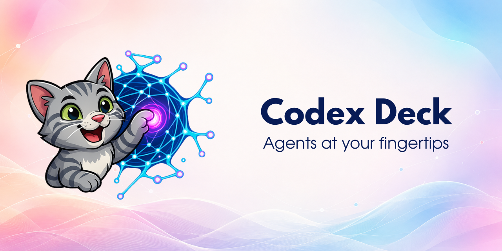
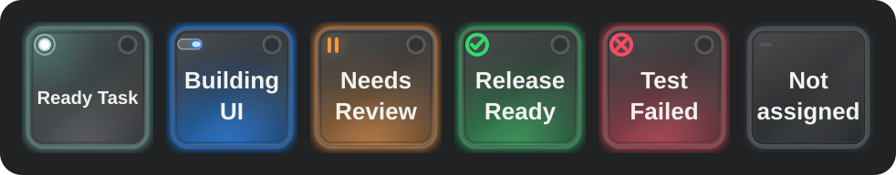
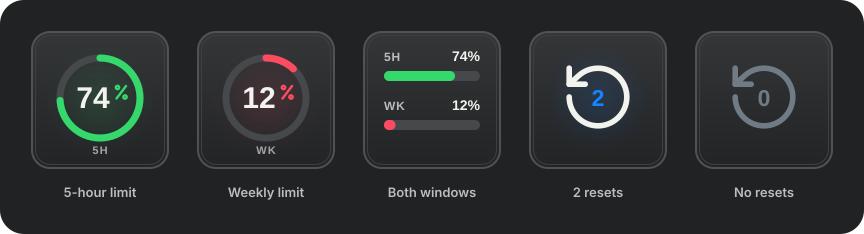

<p align="center">
  
</p>

<p align="center">
  Язык: <a href="README.md">English</a> · <strong>Русский</strong>
</p>

# Codex Deck

[](https://github.com/xonika9/codex-stream-deck/actions/workflows/ci.yml)

Codex Deck переносит модель управления Codex Micro на Elgato Stream Deck. Он отражает шесть встроенных слотов агентов Codex и отправляет собственные события Micro для действий, направлений джойстика, нажатий энкодера, уровня рассуждений и официальных команд клавиш. Проект не вводит текст и не зависит от глобальных сочетаний клавиш.

Этот репозиторий — форк и продолжение проекта [dazer1234/codex-stream-deck](https://github.com/dazer1234/codex-stream-deck). Текущую разработку и выпуски поддерживает [xonika9](https://github.com/xonika9).

> Полевыми заметками об AI-моделях и инструментах для разработчиков я делюсь в телеграм-канале [«Контролируемые галлюцинации»](https://t.me/+DOZWlhI4r4EyYjgy).

> [!IMPORTANT]
> Это независимый общественный проект. Он не создан, не поддерживается и не одобрен OpenAI или Elgato. Проект использует недокументированные внутренние механизмы настольного Codex, поэтому после обновления Codex ему может потребоваться адаптация.



## Выберите режим

Один и тот же пакет плагина Stream Deck работает во всех трёх режимах. Установите только тот запускатор и ту конфигурацию, которые нужны для вашего варианта.

| Режим | Приложение Stream Deck | Управляемый Codex | Руководство |
|---|---|---|---|
| Только Windows | Windows | Локальный Codex для Windows | [Настройка Windows](docs/WINDOWS.md) |
| Только Mac | macOS | Локальный Codex для Mac | [Настройка macOS](docs/MACOS.md) |
| Windows + Mac | Windows | Оба приложения; шесть агентов объединяются | [Настройка нескольких узлов](docs/MULTI_HOST.md) |
| Приложение для iPhone | iOS 17+ | Частные узлы Mac и/или Windows | [Приложение для iPhone](docs/IOS.md) · [Установка из исходников](docs/IOS_INSTALL.md) |

При работе только с настольными приложениями режимы Windows и Mac не требуют ретранслятора, второго компьютера или меток узлов. Для приложения iPhone включается отдельный аутентифицированный ретранслятор с закреплённым TLS-сертификатом; режим с несколькими настольными узлами остаётся необязательным.

## Требования

- Настольный Codex на управляемом компьютере.
- Elgato Stream Deck 6.6 или новее на компьютере, к которому подключён Stream Deck.
- Node.js 20 или новее для платформенного запускатора.
- Windows 10+ или macOS 13+.
- Проверенное устройство: обычный 15-клавишный Stream Deck MK.2.

Другие модели Stream Deck могут работать, но готовая раскладка и проверка на физическом устройстве ориентированы на стандартный MK.2 с сеткой 5×3.

## Быстрая установка

> [!NOTE]
> У этого форка пока нет опубликованного бинарного выпуска. Ниже описан будущий путь установки со [страницы выпусков](https://github.com/xonika9/codex-stream-deck/releases); текущие исходники можно собрать командами из раздела [«Сборка и проверка выпуска»](#сборка-и-проверка-выпуска).

1. Скачайте `com.xonika9.codex-deck.streamDeckPlugin` из подходящего выпуска xonika9 и откройте его на компьютере с Stream Deck.
2. Скачайте только запускатор для этого компьютера:
   - Windows: `codex-deck-launcher-windows-vX.Y.Z.zip`
   - macOS: `codex-deck-launcher-macos-vX.Y.Z.zip`
3. Следуйте руководству для [Windows](docs/WINDOWS.md), [macOS](docs/MACOS.md) или [Windows + Mac](docs/MULTI_HOST.md).
4. В **Codex Settings > Codex Micro** выберите источник агентов, назначения действий, действия джойстика и поведение энкодера.
5. Соберите две страницы Stream Deck, описанные ниже.

Приложение для iPhone пока распространяется только в исходниках: **для его сборки, подписи и установки нужен Mac с Xcode**, даже если телефон будет управлять только узлом Codex под Windows. Сборки в App Store, TestFlight или заранее подписанного IPA пока нет. После установки Mac не обязан оставаться включённым, если только он сам не относится к управляемым компьютерам. Сопряжение поблизости работает в одной частной сети Wi-Fi без Tailscale; для частного управления вне дома добавьте Tailscale. См. [руководство по установке для начинающих](docs/IOS_INSTALL.md) и [проверку в локальной сети Wi-Fi](docs/IOS_LOCAL_WIFI.md).

В режиме Windows + Mac выберите одинаковый источник агентов в обоих приложениях Codex, если хотите объединить два встроенных списка Pinned или два набора назначений Individual. Закреплённые задачи чередуются справедливо. Если приложения назначили разные задачи одной кнопке Individual, приоритет получает компьютер со Stream Deck, а второй компьютер заполняет свободные слоты. Зеркальные копии одной задачи показываются только один раз. См. [поведение нескольких узлов](docs/MULTI_HOST.md#agent-source-modes).

> [!WARNING]
> Форк xonika9 использует новый UUID плагина `com.xonika9.codex-deck`. Stream Deck считает его отдельным от исходного `com.simeo.codex-deck`: существующие действия, их параметры и общие настройки плагина автоматически не переносятся. Сохраните или экспортируйте профили, не держите обе версии включёнными одновременно, заново соберите обе страницы из новых действий, а затем удалите старый плагин. Локальные данные узлов, ретранслятора и пользовательских значков остаются в прежнем каталоге; служба-наблюдатель macOS намеренно сохраняет метку `com.simeo.codex-deck.watcher`.

## Возможности

- Шесть динамических клавиш агентов, использующих источник и назначения из **Codex Settings > Codex Micro**.
- Состояния простоя, работы, непрочитанного завершения, запроса подтверждения или ввода, ошибки и пустого слота в реальном времени.
- Светлое и тёмное оформление в стиле Codex со сдержанной анимацией состояний.
- Встроенная обработка нажатия и отпускания для слотов Micro от `ACT06` до `ACT12`.
- Встроенные команды джойстика вверх, вправо, вниз и влево, а также нажатие энкодера.
- Отдельные кнопки повышения и понижения уровня рассуждений с повтором при удержании.
- Управление лимитами в реальном времени: настраиваемая круговая клавиша для пятичасового или недельного окна и обзор двух окон.
- Счётчик кредитов сброса по центру; доступный кредит расходуется только после намеренного удержания в течение 1,2 секунды.
- Локальное действие `codex://threads/new` для новой задачи.
- Отдельные действия для всех официальных клавиш единичного размера, которые определяются из установленной сборки Codex во время выполнения.
- Необязательная локальная загрузка официальных SVG клавиш; защищённые файлы никогда не входят в репозиторий или выпуски.
- Необязательный аутентифицированный ретранслятор SSH/Tailscale, чтобы один Stream Deck мог одновременно управлять Codex под Windows и Mac.
- Состояние каждого узла на клавише выбора Windows/Mac; последние известные плитки агентов заметно помечаются, если встроенные сигналы рабочего стола ненадёжны или ретранслятор недоступен.
- Встроенное приложение SwiftUI для iPhone с агентами двух узлов, лимитами, кредитами сброса и аутентифицированным управлением Micro через локальный Wi-Fi с закреплённым TLS-сертификатом или частный HTTPS Tailscale.

## Рекомендуемая раскладка на 15 клавиш

Это готовая двухстраничная раскладка для MK.2. Шесть агентов остаются на главной странице, а менее частые команды навигации и управления рассуждениями вынесены на вторую.

> Это только рекомендация и практичная отправная точка. Любые действия, позиции, страницы и профили можно свободно настроить под свой процесс; Codex Deck не требует именно такой раскладки.

### Страница 1 — агенты и повседневные действия

| Агент 1 | Агент 2 | Агент 3 | Агент 4 | Агент 5 |
|---|---|---|---|---|
| Агент 6 | Действие 1 / Fast | Действие 2 / Approve | Действие 3 / Reject | Действие 4 / Fork |
| Действие 5 / Push-to-talk | Клавиша · Browser¹ | Stream Deck: следующая страница | Нажатие энкодера рассуждений | Новая задача |

Названия действий описывают стандартную настройку Codex Micro. Клавиши всегда следуют актуальным назначениям `ACT06`, `ACT07`, `ACT08`, `ACT09` и `ACT10/11`, выбранным в Codex. ¹Если вы чаще используете `ACT12` / Send, чем Browser, поставьте в эту позицию **Действие 6 / Send**.

### Страница 2 — навигация и рассуждения

| Цель Windows / Mac + состояние² | Пусто | Джойстик вверх / Plan | Рассуждения ниже | Рассуждения выше |
|---|---|---|---|---|
| Пусто | Джойстик влево / Back | Stream Deck: предыдущая страница | Джойстик вправо / Forward | Нажатие энкодера рассуждений |
| Stream Deck: сменить профиль³ | Пусто | Джойстик вниз / Sidebar | Пусто | Новая задача |

²Используйте клавишу выбора цели только в режиме Windows + Mac. На одном компьютере оставьте её пустой или замените другой командой клавиши. ³Настройте встроенное действие Stream Deck **Switch Profile**, чтобы вернуться к своему обычному профилю; проект не распространяет идентификаторы пользовательских профилей.

Навигация по страницам и смена профиля — встроенные действия Stream Deck. Все остальные названные команды предоставляет Codex Deck. Каждая официальная клавиша Codex Micro также доступна как отдельное действие, поэтому дополнительные страницы можно настраивать, не меняя шесть синхронизированных слотов действий Micro.

### Лимиты и управление сбросом



Добавьте **Usage Limit** для кругового отображения доступного ресурса. В инспекторе свойств Stream Deck клавишу можно закрепить за окном **5 hours** или **Weekly**; режим **Automatic** предпочитает пять часов и переключается на неделю, если Codex временно не сообщает короткое окно. **Usage Overview** показывает оба окна отдельными горизонтальными полосами; отсутствующее окно остаётся видимым как недоступное, а не принимается за нулевой остаток.

**Rate Limit Reset** показывает количество кредитов, которое сейчас сообщает Codex. Число остаётся по центру стрелки сброса, а действие приглушается только при отсутствии кредита. Чтобы потратить кредит, удерживайте клавишу 1,2 секунды; короткое нажатие ничего не делает, и встроенная проверка применимости Codex всё равно должна пройти. Действие использует текущий встроенный клиент лимитов Codex и относится к той же границе недокументированной совместимости, что и мост Micro.

Лимиты и кредиты сброса относятся к учётной записи. Поэтому в режиме Windows + Mac эти три клавиши не следуют за выбором Windows/Mac: они предпочитают исправный локальный снимок учётной записи и обращаются к парному узлу только при отсутствии локальных данных.

## Официальные SVG клавиш не включены

Публичный исходный код и выпуски намеренно не содержат SVG-файлы официальных клавиш OpenAI Codex Micro. Собственные плитки агентов, индикаторы состояний, свечение, анимации, резервные подписи и графика плагина включены.

Если у вас есть право использовать файлы из собственной установки Codex, скопируйте их вне репозитория в:

```text
Windows: %LOCALAPPDATA%\CodexDeck\icons
macOS:   ~/Library/Application Support/CodexDeck/icons
```

Назовите каждую копию по идентификатору клавиши Codex, например `FAST.svg`, `APPR.svg`, `REJ.svg`, `SPLIT.svg` или `MIC.svg`. По явному указанию не перерисовывать, не скачивать, не отправлять, не публиковать и не коммитить файлы Codex может изучить локальную установку и скопировать точные существующие SVG. Защищённый порядок действий и полный список имён приведены в [руководстве по локальным значкам](docs/ICON_SETUP.md).

## Как это работает

```text
Клавиша Stream Deck
    -> плагин Codex Deck
    -> локальное подключение Chrome DevTools
    -> шина событий хоста рендерера Codex
    -> встроенный обработчик Codex Micro
```

Запускатор включает случайный порт Chrome DevTools, привязанный к `127.0.0.1`. Плагин находит модули рендерера с хешем версии, читает встроенную раскладку и состояние Micro и отправляет те же семейства событий, которые использует интеграция Micro:

- `codex-micro-device-state-changed`
- `codex-micro-hid-event`
- `codex-micro-joystick-event`

Виртуальный драйвер HID не устанавливается, файлы приложения Codex не изменяются. Подробнее см. [архитектуру и безопасность](docs/ARCHITECTURE.md).

## Безопасность и конфиденциальность

- Отладочный адрес Codex остаётся доступен только через loopback и никогда не используется как адрес ретранслятора нескольких узлов.
- CDP предоставляет широкие полномочия: другой недоверенный процесс от имени того же локального пользователя может попытаться получить к нему доступ.
- В Codex Deck нет телеметрии, облачного сервиса и службы обновлений.
- Codex Deck читает точные имена локальных файлов rollout, чтобы определить принадлежность, и ограниченный недавний хвост структурных меток состояния вместе с числовыми полями `token_count`. Он не разбирает и не передаёт запросы, ответы, названия проектов и другое содержимое разговоров.
- Необязательные SVG остаются в локальной пользовательской папке значков и никогда не отправляются в сеть.
- Режим нескольких узлов принимает только аутентифицированные типизированные команды Codex Deck через SSH или Tailscale; подстановочные и произвольные слушатели на публичных IP-адресах отклоняются.
- Частные токены ретранслятора, локальное состояние узлов, журналы и личные пути исключаются проверкой выпуска.

Не используйте запускатор одновременно с недоверенными локальными программами. См. [SECURITY.md](SECURITY.md).

## Совместимость

Совместимость версионируется с каждым выпуском, поскольку Codex Deck зависит от недокументированных внутренних механизмов настольного Codex. После первого выпуска xonika9 проверенные сочетания версий будут указаны на [странице выпусков](https://github.com/xonika9/codex-stream-deck/releases).

Последняя проверка исходного проекта охватывала путь Windows с физическим устройством и ретранслятор Windows + Mac на реальной конфигурации. Также были проверены запускатор, наблюдатель, встроенный мост и пакет плагина для macOS, но не Stream Deck, физически подключённый к Mac. Это исторические свидетельства проверки, а не строгие минимумы, максимумы или гарантия для последующих сборок Codex.

## Устранение неполадок

Начните с [руководства по устранению неполадок](docs/TROUBLESHOOTING.md). Главное правило: после обновления плагина перезапускайте только плагин или приложение Stream Deck. Наблюдатель macOS никогда не запускает закрытое приложение Codex; после ручного запуска он допускает не более одного защищённого восстановительного перезапуска, а затем включает общую задержку перед следующей попыткой восстановления.

## Сборка и проверка выпуска

```powershell
npm ci
npm run check
npm test
npm run validate
npm run pack
npm run audit:release
```

Команда `npm run release:prepare` создаёт локальную папку кандидата в выпуск с версией, пакетом плагина, ZIP запускатора Windows и контрольными суммами SHA-256. ZIP для macOS нужно создавать на macOS скриптом `scripts/package-macos-release.sh`, чтобы сохранить исполняемые биты; передайте этот ZIP в `scripts/prepare-release.ps1 -MacArchivePath ...`.

Для исправления Stream Deck с четырёхкомпонентной версией задайте `CODEX_DECK_RELEASE_VERSION=X.Y.Z.W` при запуске упаковщика macOS и передайте `-ReleaseVersion X.Y.Z.W` в `prepare-release.ps1`. Пакет npm сохранит форму предварительного выпуска, совместимую с SemVer.

Ничего не публикуется автоматически. См. [CONTRIBUTING.md](CONTRIBUTING.md).

## Благодарности

Идея исследовать нативный мобильный компаньон Codex Micro отчасти вдохновлена публичной мобильной концепцией [Shikhar (@xikhar)](https://x.com/xikhar). Codex Deck Mobile — независимая реализация на основе собственного аутентифицированного моста, встроенных элементов управления и визуальной системы этого проекта; исходный код и графика из той концепции не использовались.

## Лицензия и товарные знаки

Код и оригинальная графика распространяются по лицензии [MIT](LICENSE). OpenAI, Codex, ChatGPT, Elgato, Stream Deck, а также их товарные знаки и материалы принадлежат соответствующим владельцам; лицензия не распространяется на сторонние и предоставленные пользователем материалы.
