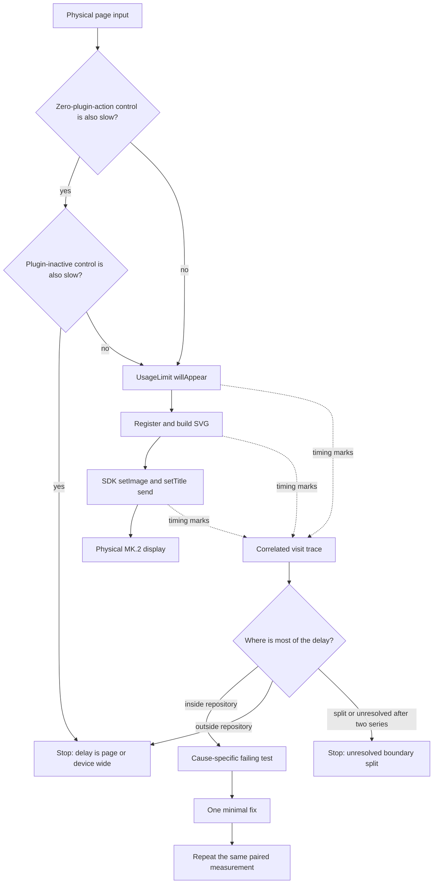

# Stream Deck Page Delay - Plan

## Goal Capsule

- **Objective:** Find the layer that creates the repeatable delay of about five seconds when page 2 of the `x9` profile appears on a physical Stream Deck MK.2, then apply one small fix only when the delayed layer is inside this repository.
- **Authority:** The measured physical-device trace and R1-R9 override static hypotheses about animation, caching, Codex, Watcher, SDK calls, or USB behavior.
- **Execution profile:** Characterization first. Preserve the same device, profile, action, software versions, and measurement method before and after the fix.
- **Stop conditions:** Stop without a plugin fix when the delay remains equally slow with this plugin's process stopped or disabled; when the delay is before `willAppear`, plugin event-loop lag stays below 100 ms, no plugin work is in flight, and no outbound SDK burst or background refresh appears in the preceding window under the bounded command-load control; or when the delay remains entirely after the SDK send boundary and satisfies a predeclared command-load equivalence rule. If no single boundary owns the delay after two instrumented paired series, stop with an unresolved localization instead of adding unbounded instrumentation. If the measured cause is inside this repository but cannot be corrected with one small change, stop before implementation and route the larger correction to follow-up work. If the instrumented build fails to reproduce the qualitative baseline across ten delayed entries, restore the same cold conditions and retry once; a second miss ends as a documented non-reproducible result with no production correction.
- **Tail ownership:** Remove temporary high-volume diagnostics before the final paired series, retain only justified low-noise diagnostics and regression coverage for the confirmed cause, and report automated, live-app, and physical-device validation separately.

---

## Product Contract

### Summary

This plan targets the visible page-switch delay on the existing experimental `x9` profile. It separates the physical page transition from plugin rendering and SDK sending, fixes only the measured bottleneck, and repeats the same physical test after the change.

### Problem Frame

Page 2 of `x9` visibly takes about five seconds to settle on a Stream Deck MK.2. The page currently contains one `Usage Limit` action from this fork, so the delay does not require a page full of this plugin's buttons. Static inspection exposes several five-second windows and render races, but none proves where the observed delay occurs. The first `Usage Limit` image uses an in-memory snapshot and synchronous SVG rendering; it does not intentionally wait for a fresh Codex or Watcher result.

### Actors

- A1. The user switches pages on the physical Stream Deck MK.2 and records the device view.
- A2. The implementer correlates the physical recording with plugin lifecycle and send timings.

### Requirements

**Reproduction and measurement**

- R1. Use the existing experimental profile `x9` and its page-2 `Usage Limit` action as the primary reproduction case; do not create another profile.
- R2. Establish a paired physical baseline for the plugin page and an existing control page or state that contains no action from this plugin. Record a second existing control containing only static actions from this plugin when the profile provides one. If the zero-plugin-action control is equally slow, repeat that control with this plugin's process stopped or disabled in Stream Deck without uninstalling it; only a delay that remains under the plugin-inactive control can justify a page-wide external stop.
- R3. Measure the boundaries from physical page input through `willAppear`, registration, SVG completion, SDK call and SDK promise completion, while treating physical display as a separate final boundary. Align video and trace time with millisecond-resolution visible system-clock markers at the start and end of each series, log wall-clock and monotonic timestamps together, and report the resulting alignment uncertainty. Re-record any series whose alignment uncertainty exceeds 250 ms before attributing a physical-to-trace boundary.
- R4. Correlate every page visit with a run identifier and visit ordinal; label first entry after app or profile load separately from warm re-entry; and record duplicate sends, background-render overlap, disappearance, and late completion for the same action context.

**Evidence-gated correction**

- R5. Choose the cause from measured timing rather than from a matching five-second constant or a static race alone.
- R6. When localization identifies a repository-controlled seam, add a deterministic behavioral regression test at that seam before changing its behavior.
- R7. When localization identifies a repository-controlled seam, apply one minimal correction in that layer and avoid unrelated renderer, Watcher, Codex bridge, relay, profile, or visual changes.

**Acceptance and preservation**

- R8. Repeat the paired physical measurement with the same method. A full plugin-fix result must remove the repeatable five-second tail without breaking static image rendering, usage content, page re-entry, or background refresh. A partial plugin-fix result must demonstrate removal of the measured repository-controlled contribution and document the residual external boundary. External, unresolved, non-reproducible, and larger-follow-up results must repeat the cleaned paired measurement where applicable, document the measured or unresolved boundaries and required next owner, and must not claim that the delay is fixed.
- R9. Remove temporary high-volume timing marks before the final paired physical series so the accepted build is the build that was measured; retain only low-noise diagnostics with stated ongoing support value.

### Key Flows

- F1. Baseline and control comparison
  - **Trigger:** A1 enters page 2 from the adjacent page.
  - **Actors:** A1, A2
  - **Steps:** Record repeated transitions with `Usage Limit`; repeat against the named zero-plugin-action control and, when available, the static-only plugin control; when the zero-plugin-action control is also slow, repeat it with the plugin process inactive; preserve the profile and version context.
  - **Outcome:** The delay is classified as page-wide, plugin-associated, or still ambiguous.
  - **Covered by:** R1, R2, R8
- F2. Layer localization
  - **Trigger:** The unchanged delayed case is reproduced with timing marks enabled.
  - **Actors:** A1, A2
  - **Steps:** Correlate the physical transition with action lifecycle, render completion, SDK send completion, and background activity.
  - **Outcome:** One boundary owns most of the observed delay; the repository is ruled out as the fix surface; or two bounded instrumented series end with a documented split or unresolved localization.
  - **Covered by:** R3-R5
- F3. Evidence-backed correction
  - **Trigger:** F2 identifies a delayed seam controlled by this repository.
  - **Actors:** A2
  - **Steps:** Reproduce the seam with a deterministic test; make one focused change; repeat automated, live-app, and physical checks.
  - **Outcome:** The five-second tail is removed and the relevant lifecycle invariant remains covered.
  - **Covered by:** R6-R8

### Acceptance Examples

- AE1. **Covers R1-R4.** Given page 2 with one fork `Usage Limit` action, when the user records repeated entries and visible start/end clock markers, then each numbered visit can be matched to one lifecycle trace and a physical completion time without manually operating a stopwatch for every press.
- AE2. **Covers R5 and R7.** Given that the delay occurs before `willAppear` while plugin event-loop lag stays below 100 ms with no in-flight or recently queued plugin work, or equally affects the plugin-inactive control, when localization finishes, then no speculative controller, bridge, or Watcher fix is committed.
- AE3. **Covers R5-R7.** Given that two concurrent renders pass the image cache before either SDK promise completes, when the measured trace links that overlap to the delay, then a controlled-promise test fails before the smallest deduplication or serialization fix and passes afterward.
- AE4. **Covers R8-R9.** Given a cleaned final candidate build containing a plugin-side fix on the same MK.2 and profile, when the paired series is repeated, then the full five-second tail or the measured repository-controlled contribution is absent and page re-entry still renders the correct usage image.

### Success Criteria

- The initial diagnostic report contains at least ten recorded page entries for the delayed case and ten for the zero-plugin-action control, with cold and warm entries reported separately, plus median, slowest sample, and the visible shape of the tail.
- Localization assigns each visit to one of four sequential boundaries: before `willAppear`, inside plugin preparation, inside SDK sending, or after SDK sending; background refresh is recorded as an additional modifier. A boundary owns the delay when its median contribution is at least three seconds of the observed five-second median. If no boundary reaches that threshold, refine the two largest contributors and run one more instrumented paired series; a second inconclusive series ends as a documented split or unresolved localization.
- For a warm-entry tail, a full plugin-side fix is accepted only when a final series of at least thirty delayed-page entries and thirty zero-plugin-action control entries contains no sample at or above three seconds and the delayed-page p95 is within 500 ms of the control p95. A one-second p95 is a target, and becomes a gate only when the same-session control p95 is at or below one second.
- For a cold-only tail, use a fixed reset procedure: restart the same Stream Deck app or reload the same `x9` profile, wait until the same ready condition is visible, record exactly one first entry, and repeat on counterbalanced delayed/control starts. Require ten independent cold entries per page for the diagnostic series and ten per page for final acceptance; report median and slowest sample, require no delayed sample at or above three seconds, and require the delayed median to stay within 500 ms of the control median.
- When a repository boundary owned only part of the observed delay, accept a partial plugin fix when the corrected boundary's measured contribution is removed, the delayed-page median and p95 improve by at least that boundary's baseline median contribution, and the same-session control remains within baseline variation. Record the residual external contribution and its next owner instead of requiring full control parity.
- If the plugin-inactive control also has the five-second delay, or the plugin trace finishes promptly while the device remains delayed independently of command load, successful completion means a documented external localization rather than an invented code change.
- If localization identifies a repository-controlled cause whose correction exceeds one small change, successful completion for this plan means documenting the cause and required scope, then deferring implementation rather than committing a partial workaround.

### Scope Boundaries

**In scope**

- The current `x9` profile, one `Usage Limit` action, Stream Deck app, this plugin process, and the physical MK.2 display boundary.
- Temporary low-overhead timing marks, one cause-specific regression seam, one cause-specific fix, and compatibility notes when renderer behavior changes. Only justified low-noise diagnostics may remain in the final diff.

**Deferred to follow-up work**

- General latest-frame scheduling, animation frame-rate changes, broad `setTitle` cleanup, and invisible-action cancellation unless this trace proves one of them causes the observed delay.
- Performance suites for 1, 3, and 6 animated agent keys.
- A durable `docs/solutions` learning after the cause has been proven and fixed.

**Out of scope**

- Creating another Stream Deck profile or reinstalling the fork, Watcher, Stream Deck, or Codex.
- PR #9, PR #10, issue #11, thread-ID normalization, MIC routing, long-press work, Otty support, visual redesign, release packaging, CI expansion, and dependency updates.
- Rebinding or exposing the Codex Chrome DevTools endpoint beyond loopback.

### Product Key Decisions

- **Use the existing `x9` profile.** (session-settled: user-directed — chosen over a new development profile: `x9` was created for experiments and already contains the fork action.) Governs R1-R2.
- **Treat one `Usage Limit` action as the primary case.** The observed delay persists without many plugin actions, so button count is evidence to record rather than the assumed cause. Governs R1, R5, R7.

---

## Planning Contract

### Key Technical Decisions

- KTD1. **Localize before correcting.** (session-settled: user-approved — chosen over implementing several plausible optimizations together: the user approved the sequence baseline, testable cause, one code slice, and repeated measurement.) The executor must cross the evidence gate in R5 before U3 starts.
- KTD2. **Use paired physical video plus structured plugin timing.** Device video owns physical time because SDK 2.1.0 promises only prove that a command was sent to Stream Deck. Physical latency starts on the first video frame showing page-key actuation and ends on the first frame where the complete target page, including the current `Usage Limit` image, remains unchanged for three consecutive frames. Record the video frame rate. Each continuous series begins and ends with a visible system-clock marker; the trace records `Date.now()` beside monotonic timing so the executor can align the two clocks, calculate drift, and report uncertainty. The user starts the recording, shows the two clock markers, and changes pages; frame counting and visit mapping belong to the executor.
- KTD3. **Use a stop result when the repository is not the delayed layer.** A clean localization outside this plugin is a valid outcome. Controller edits without a measured plugin-side delay violate R5 and R7.
- KTD4. **Make the regression seam match the observed cause.** Controlled promises and fake time are preferred for lifecycle, deduplication, timeout, or cache boundaries. Source-regex assertions do not prove ordering or latency behavior.
- KTD5. **Keep diagnosis and acceptance artifacts distinct.** The U1 instrumented series is diagnostic evidence, not the final acceptance baseline. Final acceptance compares delayed and control pages on the same cleaned candidate build, using the same physical method and the absolute and control-relative Success Criteria. Temporary high-volume timing is removed before that series; only low-noise diagnostics with stated ongoing operational value may remain.

### High-Level Technical Design

### Evidence Gate

| Measured boundary | Interpretation | Allowed result |
|---|---|---|
| Physical input to `willAppear` | Stream Deck navigation, profile, app, or device path is slow before this action runs, unless this plugin blocked the process or left SDK/background work queued | Stop plugin changes only when event-loop lag stays below 100 ms, no plugin work is in flight, and the preceding window contains no outbound SDK burst or background refresh under the bounded command-load control; otherwise instrument the blocking plugin substage |
| `willAppear` to SVG ready | Registration or synchronous render work is slow | Characterize and fix `src/actions.ts`, `src/controller.ts`, or `src/render.ts` only |
| SVG ready to SDK promises complete | Duplicate work, command volume, title/image sequencing, or Stream Deck connection send is slow | Characterize with controlled `KeyAction` promises; fix the measured send/lifecycle mechanism |
| SDK promises complete to physical display | Downstream Stream Deck software, rasterization, USB, hub, or device path remains | Run one command-load A/B; fix plugin scheduling only if the physical delay tracks plugin load, otherwise stop |
| Modifier: background refresh overlaps a slow visit | A bridge, ownership, relay, or render-all path may indirectly create contention | Instrument that exact substage; change its five-second window only if the trace assigns the delay there |

A boundary owns the delay only when its median contribution reaches the three-second threshold in Success Criteria. If no boundary owns the delay, refine the two largest contributors and repeat U1 once; a second inconclusive result stops production changes and records a split or unresolved localization.

### Implementation Constraints

- Preserve Windows-only, macOS-only, and optional multi-host operation even though the primary physical reproduction is the user's current MK.2 setup.
- Do not treat `await action.setImage()` as proof that the device displayed the image.
- Do not persist or commit profiles, logs, recordings, rollout data, personal paths, pairing material, or generated release bundles.
- Preserve the non-overlapping refresh and unchanged-image suppression described in `docs/ARCHITECTURE.md`.
- Keep Chrome DevTools discovery and connection on loopback.

### Sequencing

U1 first runs the unchanged delayed-page and control comparison without code changes. Only when the plugin-inactive control does not establish a page-wide external stop does U1 add timing marks and repeat delayed/control measurement on the same instrumented build. U2 either turns the measured repository-controlled seam into an automated failure and selects one U3 branch, or records a terminal external, unresolved, non-reproducible, or larger-follow-up result. U3 runs only for a repository-controlled correction that fits one small change. U4 removes diagnostic residue and performs final verification. U3 must not begin from static suspicion alone.

### Sources and Research

- `src/actions.ts` owns `UsageLimit` appearance and disappearance callbacks.
- `src/controller.ts` owns registration, background refresh, image caching, rendering, SDK sends, and action removal.
- `src/render.ts` owns synchronous `Usage Limit` SVG generation.
- `src/codex-micro-renderer-bridge.ts`, `src/session-ownership.ts`, and `src/relay-protocol.ts` contain competing five-second boundaries; they are candidates, not ranked causes.
- `test/micro-bridge.test.ts` currently checks controller performance invariants through source text and does not execute the lifecycle.
- `node_modules/@elgato/streamdeck/dist/plugin/actions/key.d.ts` and the installed SDK implementation show that image-send promises do not acknowledge physical display.
- No `docs/solutions` corpus or root `CONCEPTS.md` exists, so no institutional learning was available to govern this plan.

---

## Implementation Units

### U1. Establish the paired baseline and visit trace

- **Goal:** Produce evidence that separates page-wide physical delay from plugin preparation and SDK sending.
- **Requirements:** R1-R5; F1-F2; AE1-AE2
- **Dependencies:** None
- **Files:** `src/actions.ts`, `src/controller.ts`, `test/controller-render-lifecycle.test.ts`
- **Approach:**
  1. Before changing code, name and record the unchanged `x9` page-2 case and zero-plugin-action control with the same device, navigation direction, Stream Deck version, plugin build, and Codex state. If both are slow, repeat the control with the plugin process stopped or disabled; stop without instrumentation only when that plugin-inactive control remains equally slow.
  2. When the unchanged controls do not establish a page-wide external stop, record the static-only plugin control when one exists, then add instrumentation. Start and end each continuous series with a millisecond-resolution visible system-clock marker. Add a run identifier, visit ordinal, wall-clock timestamp, and monotonic timing marks for appearance, registration, SVG completion, individual SDK calls, SDK completion, disappearance, and overlapping background render work.
  3. Record image hash or length, cache decision, render source, and action context without logging image contents or private Codex state.
  4. Keep physical video as the authority for physical input and display completion; record its frame rate, use the three-stable-frame completion rule, reject alignment uncertainty above 250 ms, and do not claim the trace observes USB or LCD completion. Page-switch completion is the first complete stable render from the currently available local state; any later snapshot-driven replacement is a separate refresh-latency event and does not extend the primary page-switch measurement.
  5. Mark the first entry after Stream Deck app or profile load separately from warm re-entry. For warm measurement, use a fixed alternating delayed/control sequence with at least ten seconds of idle time between visits and require the trace to show no in-flight render or refresh when the next visit begins.
  6. If the qualitative tail appears only on cold entry, use the fixed reset-and-ready procedure from Success Criteria and collect one observation per reset until each page reaches its independent cold sample count.
- **Execution note:** Capture the qualitative unchanged baseline before instrumentation. A warm series uses one continuous video while the user switches pages; a cold-only series uses one short recording per fixed reset-and-entry cycle. The executor measures frames afterward, so the user never operates a stopwatch per press.
- **Patterns to follow:** Existing `streamDeck.logger` use in `src/controller.ts`; action lifecycle callbacks in `src/actions.ts`; privacy and artifact exclusions in `AGENTS.md` and `SECURITY.md`.
- **Test scenarios:**
  - Covers AE1. One appearance emits one correlated sequence whose timestamps are monotonic and whose action identifier is stable.
  - Two visits to the same page receive different visit identifiers.
  - Wall-clock and monotonic trace fields map the visible start/end markers to video time, and the report states alignment uncertainty.
  - A stable first render completes the page-switch measurement; a later local-snapshot replacement is recorded as a separate refresh event.
  - A disappearance closes the active visit, and a late completion is marked as late rather than attributed to the next visit.
  - Trace fields omit SVG contents, titles, thread identifiers, personal paths, and usage values.
- **Verification:** Ten delayed-case entries and ten zero-plugin-action control entries are recorded as a diagnostic series using the applicable warm or cold protocol; each delayed-case visit is classifiable against the Evidence Gate or triggers its one permitted refinement round. If instrumentation removes the qualitative tail, restore the same cold conditions and retry once; a second miss records a non-reproducible terminal result. Instrumentation overhead is small compared with the observed five-second delay.

### U2. Characterize the measured seam

- **Goal:** Convert the selected internal delay mechanism into a deterministic failing test, or stop cleanly when the delay is external.
- **Requirements:** R5-R7; F2-F3; AE2-AE3
- **Dependencies:** U1
- **Files:** `test/controller-render-lifecycle.test.ts`, and only the cause-specific production file or files plus their directly associated test file or files selected from `src/controller.ts`, `src/actions.ts`, `src/render.ts`, `src/codex-micro-renderer-bridge.ts`, `src/session-ownership.ts`, `test/micro-bridge.test.ts`, and `test/session-ownership.test.ts`
- **Approach:**
  1. Select the branch from the Evidence Gate using the measured trace.
  2. For a render or send race, use a fake `KeyAction` whose image and title promises can be released in a chosen order.
  3. For a timeout or cache boundary, use an injected clock or fake time and assert the observed state transition at the measured boundary.
  4. If the delay is external, unresolved, or non-reproducible, write no artificial failing controller test; retain the physical and live-app evidence as the terminal result.
  5. If the measured repository-controlled correction exceeds one small change, document the owner and required scope, then stop before U3 and defer the larger implementation.
- **Execution note:** Add characterization coverage before modifying behavior. Do not broaden the test to every speculative five-second constant.
- **Patterns to follow:** Promise-controlled integration tests in `test/relay.test.ts`; time-controlled state tests in `test/session-ownership.test.ts`; Node test conventions used throughout `test/`.
- **Test scenarios:**
  - Covers AE3. Two identical concurrent render attempts reproduce the measured duplicate-send or ordering failure when that is the selected branch.
  - A started render that completes after disappearance reproduces the measured late-write failure when that is the selected branch.
  - A measured cache or timeout branch reproduces at the exact pre-boundary and boundary times without wall-clock sleeping.
  - An external classification leaves production behavior unchanged and records why no automated plugin regression can honestly represent the physical delay.
- **Verification:** The new test fails for the measured internal cause and is insensitive to unmeasured hypotheses, or the unit exits with an evidence-backed external, unresolved, non-reproducible, or larger-follow-up result and no production-code fix.

### U3. Apply one cause-specific correction

- **Goal:** Remove the measured plugin-side delay with the smallest behavior change that makes U2 pass.
- **Requirements:** R5-R8; F3; AE3-AE4
- **Dependencies:** U2
- **Files:** The cause-specific production and test files selected in U2; `docs/ARCHITECTURE.md` when renderer integration behavior changes
- **Approach:**
  1. Change only the owner of the measured delay.
  2. Preserve correct page re-entry and the rule that a newly visible action receives its current image.
  3. Preserve background refresh serialization and unchanged-image suppression.
  4. Update compatibility notes if the correction changes render scheduling, lifecycle invalidation, or SDK command behavior.
  5. Do not execute this unit when U2 classified the delay outside the repository.
- **Patterns to follow:** `refreshInFlight` self-serialization and `lastImages` suppression in `src/controller.ts`; explicit action registration and removal in `src/actions.ts`.
- **Test scenarios:**
  - The U2 characterization now passes without relaxing its timing or ordering assertion.
  - A normal first appearance sends the current `Usage Limit` image once.
  - Returning to the page after disappearance still sends the correct image for the new context.
  - A background refresh during appearance cannot recreate the confirmed race or delay.
  - SDK rejection is logged and does not poison image suppression for the next valid render.
- **Verification:** The U3 slice of the diff contains one cause-specific correction, its behavioral test, and only required compatibility documentation; no speculative renderer or bridge cleanup is bundled.

### U4. Repeat validation and remove diagnostic residue

- **Goal:** Prove the outcome on the same path and leave a maintainable change.
- **Requirements:** R8-R9; AE4
- **Dependencies:** U3, or U2 when the result is an external localization, unresolved localization, non-reproducible result, or deferred larger correction
- **Files:** `src/actions.ts`, `src/controller.ts`, the selected regression test when U2 produced repository-owned characterization coverage, `docs/ARCHITECTURE.md`, this plan's `Outcome` section, and `docs/TROUBLESHOOTING.md` only when an external boundary needs a user-facing diagnostic note
- **Approach:**
  1. Remove temporary high-volume tracing and dead experimental branches before the final series; retain only bounded diagnostics whose ongoing support value is stated in the plan outcome.
  2. Run repository checks for the final diff.
  3. Restart through the existing development loop and repeat the same live-app and physical series on `x9`.
  4. Compare the same statistics and disclose whether the result is a full plugin fix, partial plugin fix, external localization, unresolved localization, non-reproducible result, or deferred larger correction.
  5. Complete the dated `Outcome` section in this plan with the paired-series statistics, per-boundary median contribution, clock-alignment uncertainty, retained low-noise diagnostics and justification, result class, and next owner. Keep raw logs and recordings uncommitted.
- **Patterns to follow:** Validation separation in `CONTRIBUTING.md`; compatibility notes in `docs/ARCHITECTURE.md`.
- **Test scenarios:**
  - Covers AE4. A warm-tail fix uses at least thirty final transitions per page; a cold-only fix uses ten independent reset-before-entry observations per page. The applicable series removes the full tail or the measured repository-controlled contribution.
  - The matching warm or cold zero-plugin-action control series remains within its same-session variation.
  - Rapid page 1 → page 2 → page 1 → page 2 renders the current image and produces no late visit attribution.
  - The page is entered once before a ready local snapshot; its first stable render completes page-switch timing, and the later snapshot replacement is recorded separately without blocking page visibility.
  - The used single-host path remains correct; when the corrected owner is shared with relay or session-ownership state, run and report the existing relay and session-ownership test suites as multi-host coverage rather than assuming coverage.
- **Verification:** Automated checks pass, the live Stream Deck app uses the current fork build, the physical MK.2 result is recorded separately, and temporary recordings or logs are not committed.

---

## System-Wide Impact

- **User:** The measurement asks for page switching and one continuous recording, not repeated manual stopwatch work.
- **Plugin lifecycle:** Any fix to action generations, send ordering, or cache timing affects every action type that shares the controller helper; shared behavior needs explicit regression coverage.
- **Codex and Watcher:** They remain unchanged unless the trace proves that a bridge substage blocks the visit. A matching timeout value alone is insufficient.
- **Platforms:** The physical baseline is device-specific, while shared controller changes must retain macOS, Windows, and optional multi-host behavior.
- **Privacy:** Timing traces must not include action image contents, Codex titles, thread identifiers, usage values, rollout paths, or pairing state.

---

## Risks and Dependencies

- The Stream Deck SDK has no physical-display acknowledgement. Video remains necessary for the last boundary.
- Manual page presses vary. Paired runs, continuous video, and median/p95 reporting reduce this noise.
- Instrumentation can perturb timing. Keep it small, compare control and delayed cases with the same instrumented build, and remove high-volume marks before final validation.
- The current development tree already contains unrelated local development-loop changes. Implementation must preserve them and avoid mixing them into cause-specific conclusions.
- A result outside the repository may require a later Elgato support investigation, USB/hub A/B, or Stream Deck profile diagnosis; that is a valid stop result, not permission to widen this plan.

---

## Verification Contract

| Gate | Applies to | Evidence | Done signal |
|---|---|---|---|
| Type safety | U1-U4 when code changes | `npm run check` | No TypeScript errors |
| Automated behavior | U1-U4 when code changes | `npm test` | Cause-specific regression and existing suite pass; platform skips are reported |
| Build and plugin validation | U1, U3-U4 when code changes | `npm run validate` | Build and Stream Deck validation succeed |
| Release audit | Only if release artifacts are intentionally built | `npm run audit:release` | Audit passes; generated bundles remain uncommitted |
| Live-app check | U1, U4 | Current fork plugin process and existing development loop | Trace is from the current build; page re-entry and usage rendering are correct |
| Physical baseline | U1 | Ten delayed and ten zero-plugin-action control transitions on the MK.2 | Delay is localized to an Evidence Gate boundary or enters its one bounded refinement round |
| Physical acceptance | U4 after a plugin fix | Warm tail: at least thirty delayed and thirty zero-plugin-action control transitions; cold-only tail: ten independent reset-before-entry observations per page on the cleaned candidate build | Full fix meets the warm or cold gate; partial fix removes the measured repository contribution, leaves control unchanged, and records the residual owner |
| Non-fix stop result | U2/U4 whenever no plugin fix is committed | Correlated trace, control comparison, and one bounded command-load A/B when required by the selected boundary | No speculative production change; diagnostics are cleaned; result and next owner are recorded in `Outcome` |

Automated tests do not count as live-app or physical-device validation. A successful build does not count as either one.

---

## Definition of Done

- R1-R5 and R8-R9 are traced to completed evidence; R6-R7 are either satisfied for a repository-controlled seam or skipped by the Evidence Gate with a recorded external, unresolved, non-reproducible, or larger-follow-up reason.
- Every implementation unit either satisfies its verification outcome or is skipped by the Evidence Gate with a recorded reason.
- A measured cause is named from correlated measurements, or the bounded refinement records an unresolved boundary split; neither result is inferred from the presence of a five-second constant.
- The final diff contains at most one cause-specific production correction, the regression coverage needed to preserve it, and any retained low-noise diagnostics justified under KTD5.
- `npm run check`, `npm test`, and `npm run validate` pass when production code changes.
- Live-app and physical MK.2 outcomes are reported separately from automated checks.
- The final paired physical run meets the success criteria when a plugin fix is applied.
- The dated `Outcome` section records the diagnostic and final statistics, boundary attribution or unresolved split, clock uncertainty, result class, retained diagnostics, and next owner.
- Abandoned experiments, temporary high-volume tracing, logs, recordings, profile exports, and generated release artifacts are absent from the diff.
- Existing user-owned and unrelated worktree changes remain intact.

## Deferred / Open Questions

### From 2026-08-10 review

- **Command-load experiment lacks a decision rule** — Evidence Gate / Verification Contract (P1, feasibility, confidence 75)

  Different executors can reach opposite conclusions about whether physical delay depends on plugin command load. Before using the post-send stop path, define the compared command sets and load levels, the number of repetitions, and the change that counts as a real effect.

- **External-stop equivalence threshold is undecided** — Goal Capsule — Stop conditions (P1, adversarial, confidence 75)

  Normal run-to-run variation can be mistaken either for a plugin effect or for no meaningful difference. Define an equivalence margin and repetition rule before using command-load independence to end the investigation without a plugin fix.

## Outcome

Status: Closed on 2026-08-10 as an external USB connection incident. The hub is
a non-blocking development caveat, not a confirmed root cause.

The user repeated the page switch after removing the only `Usage Limit` action.
The same five-second stale-page effect remained with no actions from this plugin
on either page, and it also remained after the plugin was disabled. During the
same investigation the physical MK.2 intermittently failed to light when
connected through a USB hub. After reconnecting the device and obtaining a
stable USB connection, page changes became immediate through that same hub with
`Usage Limit` present.

These observations cross the plan's external stop gate. They rule out a fix to
the plugin as the justified response to this incident, but they do not prove
which hub, port, cable, power, or USB negotiation detail caused it. No temporary
timing instrumentation or speculative performance correction was added.

Development can continue through the current hub while the device starts
reliably and page changes remain immediate. A direct connection is a diagnostic
comparison if the symptom returns, not a prerequisite for every development
session. Reopen plugin-side delay work only if the delay persists over a stable
direct connection or changes reproducibly when this plugin alone is enabled and
disabled.

The renderer thread-ID work, microphone routing from remote clients, incoming
pull requests, and the external fork remain separate follow-up work. They were
never part of the page-delay fix described by this plan.
