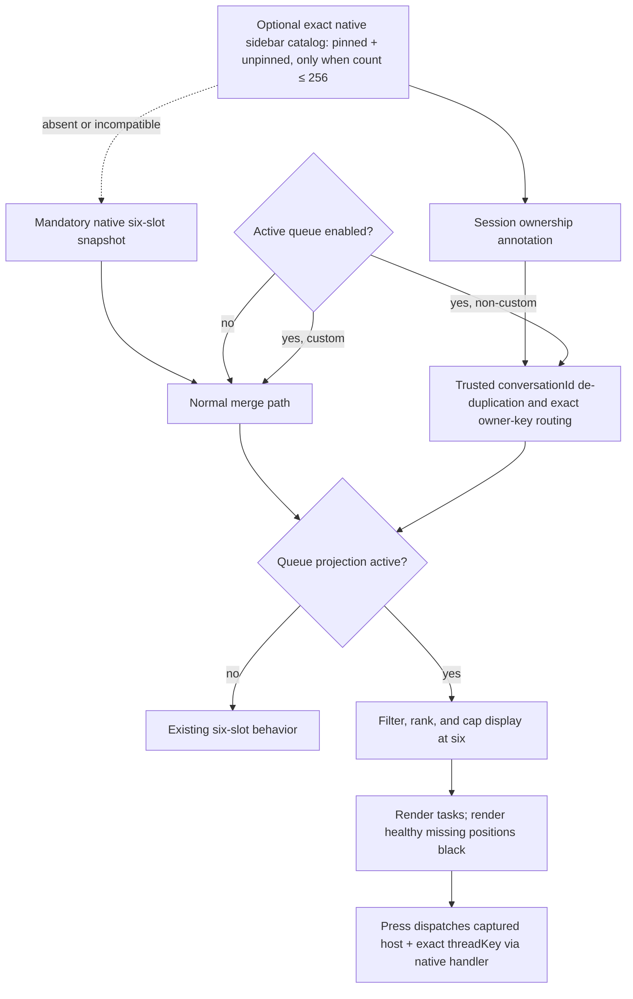

# Active Agent Queue - Plan

## Goal Capsule

- **Objective:** Add an opt-in Stream Deck view that compacts relevant tasks from Codex's bounded native pinned + unpinned renderer catalog into the first Agent keys and renders unused positions black.
- **Authority:** The user's queue behavior and later explicit 2026-08-11 expansion to the full native renderer catalog override the selected Codex source only while the option is enabled, except that `custom` retains its fixed native candidate behavior.
- **Execution profile:** Test-first TypeScript change with renderer bridge, types, ownership, relay, property-inspector, rendering, controller, multi-host, and documentation coverage.
- **Stop conditions:** Stop if the implementation requires reading task content, a task database, hotkey fallback, a non-loopback CDP endpoint, or an untyped relay expansion.
- **Tail ownership:** `ce-work` owns implementation, review, required repository checks, and local commits on `main`; it does not push or open a PR without separate authority.

---

## Product Contract

### Summary

Add `Active queue` as a global Agent-display option in the plugin property inspector.
Outside `custom`, the option filters and reorders a content-minimized native catalog of pinned and unpinned sidebar tasks, independently of the selected Codex source.
An exact catalog is accepted only when it contains at most 256 candidates; for a larger live catalog the optional field is omitted entirely rather than truncated, and the final projection remains at most six tasks. A profile with four contiguous Agent actions shows the first four.
It does not create a new Codex `agentSource`, read task content, or replace normal six-slot behavior when disabled.

### Problem Frame

Relevant tasks can be scattered among idle native slots or can sit outside the current six Micro assignments entirely.
The original plan limited the queue to those six routed slots because no privacy-safe off-six title source had yet been established.
Live renderer investigation then established a content-minimized native source: `allSidebarThreadKeys` plus native task descriptors provide status, title, and a real conversation identifier without prompt/response reads, task-database fallback, hotkeys, or UI scraping.
The user explicitly approved expanding the queue to that full pinned + unpinned catalog, so `Priority chats` or another selected non-custom source no longer limits queue membership.
The queue remains an opt-in projection because it must still hide irrelevant idle tasks, rank attention/completion/work states, compact the first six display positions, and make healthy unused positions black.

### Requirements

**Queue membership and order**

- R1. When `Active queue` is enabled outside `custom`, build each host's candidate set from the native pinned + unpinned renderer catalog derived from `allSidebarThreadKeys` and native task descriptors; include only user-attention, error, unread/completed, and working tasks regardless of the selected Codex source.
- R2. Order user-attention and error tasks first, unread/completed tasks second, and working tasks third.
- R3. Order attention and completion groups by the oldest available trustworthy state activity time first, and order working tasks by the newest activity time first. Within a group, place tasks without a trustworthy timestamp after timestamped tasks.
- R4. Use `catalogIndex`, then the exact stable thread and host identities, as deterministic tie-breakers so an unchanged snapshot does not reshuffle keys; use the native slot as the ordering hint for six-slot fallback candidates.
- R5. Compact matching tasks into logical Agent positions one through six and omit `idle`, `off`, empty, and unknown states. Profiles using fewer actions must place `Agent 1` through `Agent N` contiguously to expose the first N queue entries.
- R5a. Advertise `complete: true` only for an exact catalog of at most 256 candidates. If the exact native catalog exceeds 256, omit the optional catalog before resolving any per-key task descriptor; do not rank, truncate, or slice it to 256. Preserve the successful semantic resolver cache so a smaller next poll is reconsidered immediately. Project at most six display tasks after filtering, ownership resolution, and multi-host de-duplication; a four-action profile displays entries one through four.

**Empty and input behavior**

- R6. Render every unfilled queue position as solid black with no title, border, state marker, host badge, context ring, or animation while its target health is ready. When no assignment exists because the target is connecting, degraded, or offline, preserve the existing health tile so an outage cannot look like an empty healthy queue.
- R7. Treat a press or release on an unfilled queue position as a no-op without a command, alert, or log error.
- R8. Preserve the captured `RoutedAgentSlot` between key-down and key-up so a queue reorder cannot change the command owner, source slot, or thread. In queue mode, key-up dispatches only when its matching key-down captured an assignment; a black key that fills while held remains a no-op.

**Compatibility and control**

- R9. The option is global to all six Agent actions on one Stream Deck installation and defaults to off when absent.
- R10. When the option is off, preserve existing `pinned`, `recent`, `priority`, and `custom` behavior exactly.
- R11. Outside `custom`, annotate each host's native catalog with local session ownership, then route and de-duplicate it across hosts before projection. De-duplicate mirrors only by trusted `conversationId`, and dispatch through the host that owns the exact host-local `threadKey`; temporary or untrusted suffix matches must stay separate.
- R12. Preserve relay protocol version 1 while adding only an optional, bounded `activeCatalog` snapshot field. Enforce the final encoded `RelaySnapshotMessage` against an exact 64 KiB UTF-8 wire budget: strip `activeCatalog` and keep the base snapshot if that makes the message fit, but fail loudly when the base message alone exceeds the limit. Preserve the loopback-only CDP boundary, independent local operation on Windows and macOS, and optional authenticated multi-host operation between them.
- R13. Treat catalog discovery as optional and fail closed per host to that host's existing six native Micro slots when the catalog is absent or incompatible. An authoritative complete empty catalog remains empty. Negative-cache semantic resolver incompatibility for 15 seconds per `app-initial` URL; a URL change retries immediately. Treat a transient per-key descriptor miss as a one-poll omission that preserves the successful resolver cache and retries on the next poll. Renderer-side exact 64 KiB UTF-8 snapshot-budget overflow omits the optional catalog. Never take normal snapshot collection offline merely because optional discovery fails.
- R14. Preserve the selected source and exact existing behavior when the queue is off. While it is on, the catalog overrides `pinned`, `recent`, and `priority` candidate composition; `custom` remains limited to its fixed/native six assignments rather than expanding to the catalog.
- R15. Dispatch an exact off-six `threadKey` through the native Codex Micro HID handler. Preserve the key-down assignment through key-up; the native off-six release remains a no-op after the press dispatch.
- R16. Explain beside the property-inspector switch that the queue uses the full native pinned + unpinned catalog when available, falls back to six Micro slots, expects contiguous Agent actions, hides idle tasks, and preserves `custom`'s fixed/native boundary. Do not require or recommend `Priority chats` or `Most recent chats` for queue correctness.

### Acceptance Examples

- AE1. Covers R1, R2, R5, R6. Given two working tasks anywhere in the native sidebar catalog and no other relevant tasks, the first two Agent keys show them and the remaining four keys are black.
- AE2. Covers R1, R5, R6, R7. Given no relevant tasks, all six Agent keys are black and pressing any of them does nothing.
- AE3. Covers R2, R3, R4. Given two completed tasks with completion times 10:00 and 10:05, the 10:00 task remains ahead of the 10:05 task across identical refreshes.
- AE4. Covers R2, R3. Given four working tasks, the four most recently active tasks fill the first four positions in descending activity order.
- AE5. Covers R8, R11. Given key-down on a remote task followed by a queue reorder, key-up still targets the same captured host, source slot, and thread.
- AE6. Covers R9, R10. Given no saved `activeQueueEnabled` field, the six Agent actions preserve their existing native or combined layout.
- AE7. Covers R16. Given the Agent property inspector, the `Active queue` control states that it uses the full pinned + unpinned native catalog, displays at most six, falls back to native Micro slots, expects contiguous Agent actions, hides idle chats, and leaves `custom` on its fixed/native boundary without recommending a Codex source.
- AE8. Covers R3, R4. Given timestamped and untimestamped tasks in one group, timestamped tasks come first and two identical refreshes preserve the untimestamped order by `catalogIndex` (or fallback native slot), exact thread identity, and host identity.
- AE9. Covers R6. Given no assignment and a degraded or offline target, the Agent key keeps its existing health tile instead of rendering healthy-empty black.
- AE10. Covers R7, R8. Given key-down on a black position followed by a refresh that fills it, key-up still sends nothing and does not alert.
- AE11. Covers R1, R5a, R14. Given pinned and unpinned relevant tasks outside the native six while Codex uses `Priority chats`, those tasks participate and only the highest-ranked six are projected; a four-action profile exposes the first four.
- AE12. Covers R5a, R13. Given an exact catalog of 257 keys, omit `activeCatalog` before any per-key descriptor resolution, keep the mandatory six slots, preserve the successful resolver cache, and reconsider a smaller next poll immediately. Given an authoritative empty catalog, contribute no fallback candidates.
- AE13. Covers R11. Given two host-local keys with the same trusted `conversationId`, emit one routed task using the exact key available on the selected owner. Without a trusted `conversationId`, do not merge keys merely because their UUID suffixes match.
- AE14. Covers R12, R13. A valid protocol-v1 snapshot may omit `activeCatalog`. A malformed or 257-candidate relay field is stripped while the base snapshot is accepted. If the exact UTF-8 encoded relay message exceeds 64 KiB, strip the optional catalog and accept the fitting base; if the base alone exceeds 64 KiB, reject it loudly.
- AE15. Covers R15. Pressing a projected off-six task emits the native `codex-micro-hid-event` with its exact `threadKey` and captured logical slot; release does not use DOM activation or retarget another task.
- AE16. Covers R10, R14. In `custom`, the queue never widens the candidate set beyond the fixed native assignments; with the queue disabled, every source retains its exact prior layout and behavior.
- AE17. Covers R13. Two polls against an incompatible resolver namespace load it only once inside the 15-second negative-cache window; changing the `app-initial` URL or expiring the window retries discovery. A transient descriptor miss omits only that poll, does not poison a prior success cache, and succeeds on the next poll after the descriptor returns.

### Scope Boundaries

In scope:

- Content-minimized native renderer catalog discovery from pinned + unpinned sidebar keys and task descriptors; exact catalogs up to 256 candidates are accepted and larger catalogs are omitted without truncation.
- Ownership annotation, trusted-identity multi-host merge, exact-key routing, and a compact active/attention projection of at most six display tasks.
- A global property-inspector switch and compatibility documentation.
- Black rendering and no-op input for unfilled positions.
- Native HID dispatch of exact off-six catalog keys.

Deferred:

- Strict persistence of FIFO order across plugin restarts when no trustworthy activity timestamp exists.
- Physical-device ergonomics and visual validation until a Stream Deck is connected.

Out of scope:

- Reading prompt, response, project, or task-database content to synthesize titles.
- Hotkey, task-database, or UI-scraping fallback.
- Changing Codex's own `Priority chats` implementation or adding a new native `agentSource`.
- Advancing relay protocol beyond version 1, changing mobile clients, action UUIDs, package versions, or generated release bundles.

Accepted opt-in tradeoffs:

- Idle and off chats are unreachable from Agent keys while the queue is enabled; disable it to restore those assignments.
- The queue overrides `pinned`, `recent`, and `priority` composition with the same pinned + unpinned catalog. `custom` deliberately retains its fixed/native candidate boundary.

### Success Criteria

- The automated suite proves bounded catalog parsing, per-host fallback, trusted-identity ownership and de-duplication, exact off-six native dispatch, compaction, black empty positions, no-op input, ordering, settings preservation, `custom`, and disabled-mode compatibility.
- Read-only live bridge validation confirms a content-minimized native snapshot of 59 total catalog tasks, including 53 outside the native six, and two consecutive refreshes through the cached resolver path. It does not establish interactive queue behavior.
- Physical-device validation remains explicitly unverified while the Stream Deck is disconnected; the ergonomic result is provisional until the zero/one/two/four-task states are checked on hardware.

---

## Planning Contract

### Key Technical Decisions

- KTD1. **Use a separate plugin display option.** `(session-settled: user-directed — chosen over relying on Codex Priority chats: the reported native mode omitted currently working chats.)` Add `activeQueueEnabled?: boolean` beside `showContextRings` and default it to false. This instantiates R9 and preserves R10.
- KTD2. **Project after catalog ownership and routing.** Outside `custom`, annotate each host's native catalog, merge trusted mirrors through `HostActivityIndex.mergeActiveCatalog()`, choose an owner that has the exact dispatch key, and only then run the six-position queue projection. Keep `HostActivityIndex.merge()` as the normal-mode and `custom` candidate path rather than adding an `agentSource`. This preserves R8 and R11-R14.
- KTD3. **Superseded — the original first release was limited to routed native-six candidates.** `(superseded session-settled decision: the earlier user-directed boundary rejected rollout-content title extraction because no privacy-safe off-six title source had then been proven.)` This historical constraint is replaced by KTD7 after live renderer discovery established a content-minimized native title/status/identity source and the user explicitly approved the expansion. Rollout-content extraction remains prohibited.
- KTD4. **Prefer structural session activity without a queue-specific event stream.** For working or completed tasks, use matching `hostSessions.activityAt` when available and otherwise use the normalized activity time already carried by the native slot or optional catalog candidate. For native attention states, use that normalized candidate time. Missing or invalid times are not compared with trustworthy times; those candidates sort last within their group under R3/R4. This supports R3 while relay remains protocol version 1.
- KTD5. **Keep the existing completion lifetime.** Structural completion is eligible only while the existing ownership/routing layer still reports it as `complete`: until it is opened or its five-minute freshness window expires. Native unread/completed status may remain eligible for as long as Codex reports it. The queue does not introduce a second persistence store.
- KTD6. **Render healthy absence as a distinct black image.** Do not reuse the existing `off` tile because it communicates an unassigned white key. A dedicated renderer satisfies R6 and lets the controller short-circuit R7, while non-ready health continues to use the existing diagnostic tile.
- KTD7. **Use the full bounded native renderer catalog for Active queue.** `(session-settled: user-approved — chosen after the initial plan: expand beyond the native six using `allSidebarThreadKeys` plus native task descriptors, while remaining content-minimized.)` Discover pinned and unpinned tasks irrespective of the selected non-custom Codex source and derive status/title/real `conversationId` from renderer state. Publish `complete: true` only when the exact key set contains at most 256 entries; if it is larger, omit the catalog before per-key descriptor resolution and never rank/truncate it into a falsely complete subset. Semantic resolver incompatibility is negative-cached for 15 seconds per `app-initial` URL, while live size and transient descriptor races preserve a successful cache and retry without that backoff. Optional discovery failure falls back per host to the mandatory native six; `custom` retains its fixed/native candidate set and normal mode remains unchanged.
- KTD8. **Trust conversation identity but preserve dispatch identity.** De-duplicate across hosts only when the renderer supplies a trusted real `conversationId`. Never infer ownership from an arbitrary temporary-key UUID suffix. Route the merged candidate to an owner that exposes its own exact `threadKey`, and send that exact key through the native Codex Micro HID handler for off-six presses.
- KTD9. **Extend relay v1 compatibly and budget the complete wire message.** Carry `activeCatalog` as an optional bounded field on the existing protocol-v1 snapshot. Normalize its timestamps at receipt and sanitize to the exact allowlisted shape. Strip malformed and 257-candidate optional fields while accepting the base snapshot. Before send, measure the final serialized `RelaySnapshotMessage` in UTF-8 against 64 KiB; retry encoding without `activeCatalog` when necessary and fail loudly only when the base message itself is oversized.

### High-Level Technical Design

### Existing Patterns

- `src/relay-protocol.ts` owns status ranking, routed ownership, source slots, thread normalization, and mirror de-duplication.
- `src/controller.ts` owns global display settings, Agent rendering, held press assignments, and image write de-duplication.
- `src/render.ts` owns deterministic in-memory SVG generation.
- `static/property-inspector/agent.html` already preserves unknown global settings while changing `showContextRings`.
- `test/relay.test.ts`, `test/render-theme.test.ts`, and `test/ios-project.test.ts` contain the nearest behavior contracts.

### Risks and Dependencies

- Renderer internals are version-hashed and semantically discovered. Catalog resolver drift must disable only the optional catalog, fall back per host to the mandatory native six, and use the 15-second URL-scoped negative cache without turning transient per-key races into persistent incompatibility.
- The exact-catalog 256-candidate bound, renderer snapshot budget, exact 64 KiB UTF-8 relay-message budget, and six-position display bound must remain distinct. A large catalog must be omitted, never truncated and mislabeled complete; an oversized optional field must not discard a valid base snapshot.
- Native and structural activity timestamps can be absent. Deterministic tie-breakers must prevent refresh churn.
- Multi-host clocks can be skewed; ordering uses the timestamps already trusted by the existing routing layer and does not add clock synchronization.
- A renderer-supplied `conversationId` is the only cross-host catalog de-duplication identity; exact host-local `threadKey` remains the dispatch contract. Confusing the two could merge temporary tasks or send a command to a host that cannot handle the key.
- `pinned`, `recent`, and `priority` no longer constrain Active queue membership; `custom` deliberately remains on its native fixed candidate boundary, which the property-inspector copy must state clearly.
- A last-known active task from an offline host must keep existing health treatment and must not reroute to another host.

---

## Implementation Units

### U1. Native catalog types and renderer bridge

- **Goal:** Produce a bounded, content-minimized catalog without weakening the mandatory native-six bridge contract.
- **Requirements:** R1, R5a, R12-R14; AE11, AE12, AE14.
- **Files:** `src/types.ts`, `src/codex-micro-renderer-bridge.ts`, `src/codex-active-catalog-expression.ts`, `test/micro-bridge.test.ts`.
- **Approach:** Add typed `MicroAgentCandidate` and optional complete `activeCatalog` data. Semantically resolve `allSidebarThreadKeys`, pinned/unpinned ordering, attention/recency state, and native task descriptors from the version-hashed renderer modules. Emit only exact safe `threadKey`, trusted real `conversationId` when present, title, normalized status, selection, activity, catalog index, optional native-slot hint, ownership/context annotations, and no task content. Validate the complete key set before any per-key resolution and omit it if it exceeds 256; never rank/truncate/slice it. Cache successful resolver identities, negative-cache incompatibility for 15 seconds per `app-initial` URL, and leave success caches intact for live-size overflow or transient descriptor misses. Apply an exact 64 KiB UTF-8 renderer snapshot budget that omits only the optional catalog on overflow.
- **Test scenarios:** Execute the generated discovery expression in a behavioral harness rather than relying only on source assertions: semantic normalization and native status priority; exact 257-key omission before descriptor calls; successful-cache preservation and immediate reconsideration; 15-second incompatibility backoff with URL-change and expiry retries; transient descriptor-miss recovery on the next poll; exact renderer payload-budget fallback; required native-six independence. Retain narrow source assertions only for static integration invariants.
- **Verification:** `node --test --import tsx test/micro-bridge.test.ts` plus a read-only live bridge snapshot; do not classify the latter as interaction or device validation.

### U2. Session ownership, relay v1, and multi-host catalog routing

- **Goal:** Annotate and merge full catalogs without guessing identities or breaking protocol compatibility.
- **Requirements:** R3, R4, R11-R14; AE3, AE8, AE12-AE14, AE16.
- **Files:** `src/session-ownership.ts`, `src/relay-protocol.ts`, `src/types.ts`, `test/session-ownership.test.ts`, `test/relay.test.ts`, `test/active-queue.test.ts`.
- **Approach:** Track non-idle catalog `conversationId` values even beyond the public recent-128 session list, negatively cache missing context until a planned refresh, and annotate ownership/status/context without deriving identity from temporary keys. Add the optional catalog to protocol-v1 parsing and receiver-clock normalization, strip malformed or 257-candidate optional fields while retaining the valid base snapshot, and implement `mergeActiveCatalog()` with per-host native-six fallback, authoritative-empty semantics, trusted-`conversationId` mirror de-duplication, and exact owner-key selection. Encode the final relay message against an exact 64 KiB UTF-8 budget: remove the optional catalog if sufficient, otherwise throw for an oversized base. Use the ordinary merge for disabled mode and `custom`.
- **Test scenarios:** owned status reconciliation and completion acknowledgement; temporary key never becomes trusted ownership; tracked session beyond recent 128; negative-cache behavior; valid/omitted/malformed/257-entry catalog relay cases with base acceptance; timestamp normalization; fitting catalog preservation; UTF-8 64 KiB optional stripping; oversized-base rejection; per-host fallback versus authoritative empty; pinned + unpinned off-six candidates; trusted mirror owner selection; temporary suffixes remain separate; owner lacking an exact key is not selected; `custom` stays on native candidates.
- **Verification:** `node --test --import tsx test/session-ownership.test.ts test/relay.test.ts test/active-queue.test.ts`.

### U3. Queue projection, native input, settings, and rendering

- **Goal:** Project at most six relevant catalog tasks, dispatch exact off-six keys, and make unfilled positions visually and behaviorally empty.
- **Requirements:** R1-R10, R14-R16; AE1-AE11, AE15, AE16.
- **Files:** `src/active-queue.ts`, `src/controller.ts`, `src/codex-micro-renderer-bridge.ts`, `src/plugin.ts`, `src/render.ts`, `static/property-inspector/agent.html`, `test/active-queue.test.ts`, `test/micro-bridge.test.ts`, `test/relay.test.ts`, `test/render-theme.test.ts`, `test/ios-project.test.ts`.
- **Approach:** Select catalog merge only when Active queue is enabled, then filter, rank, and compact to six while preserving host, exact `threadKey`, native-slot hint, and ownership. Use `catalogIndex` for stable ordering. Resolve off-six dispatch as a direct native HID plan carrying the captured logical slot and exact key, never a DOM or hotkey fallback; key-up stays a no-op for this direct press. Preserve held assignments across refreshes. Keep healthy absence black/no-op and non-ready health diagnostic. Update inspector copy to describe the full catalog, six-slot fallback, contiguous placement, hidden idle tasks, and `custom` exception without recommending a Codex source.
- **Test scenarios:** zero/two/four/six/more-than-six relevant candidates; attention/completion/working order; stable missing timestamps; off-six candidates ordered by catalog index; only six projected and first four visible on a four-action profile; exact off-six native press and no-op release; no DOM fallback; empty held key remains no-op; routed held key survives reorder; black SVG and degraded/offline tiles; settings preservation; disabled source layouts unchanged; `custom` not widened.
- **Verification:** `node --test --import tsx test/active-queue.test.ts test/micro-bridge.test.ts test/relay.test.ts test/render-theme.test.ts test/ios-project.test.ts`.

### U4. Compatibility documentation

- **Goal:** Explain the full-catalog queue, its safety fallback, and the remaining validation boundary.
- **Requirements:** R9-R16.
- **Files:** `README.md`, `README.ru.md`, `docs/ARCHITECTURE.md`, `docs/MULTI_HOST.md`, `docs/TROUBLESHOOTING.md`.
- **Approach:** Document that `Active queue` is opt-in, consumes the native pinned + unpinned catalog independently of the selected non-custom source, expects contiguous logical Agent indices, displays at most six, temporarily removes deck access to idle chats, preserves trusted ownership and exact dispatch keys, falls back per host to the native six, and leaves `custom`/normal mode within their compatibility boundaries. Keep loopback CDP and no-content/no-database restrictions explicit.
- **Test scenarios:** Documentation checks cover catalog/fallback wording while retaining loopback CDP, private-state, platform, and independent multi-host boundaries; no documentation recommends `Priority chats` or `Most recent chats` as a queue prerequisite.
- **Verification:** `node --test --import tsx test/ios-project.test.ts test/release-docs.test.ts` and repository documentation tests included by `npm test`.

---

## Verification Contract

| Gate | Command | Expected signal |
|---|---|---|
| Focused behavior | `node --test --import tsx test/active-queue.test.ts test/micro-bridge.test.ts test/session-ownership.test.ts test/relay.test.ts test/render-theme.test.ts test/ios-project.test.ts test/release-docs.test.ts` | Executed renderer discovery covers exact-size omission, cache/backoff, transient retries, and payload budget; relay covers optional-field sanitization and exact UTF-8 wire budget; ownership, queue, exact off-six input, rendering, inspector, and documentation scenarios pass. |
| Type safety | `npm run check` | TypeScript completes without errors. |
| Automated regression | `npm test` | Full Node test suite passes; Windows-only skips are reported separately. |
| Package validation | `npm run validate` | Build completes and `streamdeck validate` succeeds. |
| Release audit | `npm run audit:release` | Existing release roots contain no forbidden private state. |
| Diff hygiene | `git diff --check` | No whitespace errors. |

Live-app checks:

- Completed read-only bridge evidence: one live native renderer snapshot returned 59 total catalog tasks, including 53 outside the native six, without reading prompt/response content or a task database.
- Completed read-only bridge evidence: two consecutive catalog refreshes succeeded through the cached resolver path.
- Not yet interactively verified: enable `Active queue` and confirm pinned + unpinned working/attention/completion tasks compact to the first six independently of the selected non-custom source; on a four-action profile, confirm only entries one through four are visible.
- Not yet interactively verified: confirm a projected off-six task opens through the exact native HID `threadKey`, disabling the option restores exact native positions, and `custom` remains on its fixed/native candidates.
- Not yet interactively verified: on optional multi-host, confirm a trusted mirror keeps the selected owner's host badge and exact command key, while a host without a compatible catalog falls back only to its native six.
- Do not present the read-only snapshot or cached refreshes as proof of queue interaction, multi-host behavior, or Stream Deck hardware behavior.

Physical-device checks:

- With the Stream Deck reconnected, verify zero, one, two, four, and more-than-four relevant tasks on the actual four-key profile.
- Verify black keys are visually off and produce no alert when pressed.
- Verify a task that changes state during a held press still receives the matching release.
- Physical-device validation has not been performed.

---

## Definition of Done

- U1-U4 satisfy their cited requirements and test scenarios.
- The option defaults off and preserves all existing behavior when disabled.
- The renderer catalog is content-minimized and exact: `complete: true` is emitted only for at most 256 candidates, while a larger live catalog is omitted before per-key descriptor resolution and never ranked/truncated into a partial catalog. It includes pinned + unpinned tasks regardless of the selected non-custom source and projects no more than six display tasks; four contiguous Agent actions expose the first four.
- Optional catalog failure is contained per host with native-six fallback, an authoritative empty catalog remains empty, and `custom` retains its fixed/native candidate behavior.
- Multi-host catalog mirrors de-duplicate only by trusted `conversationId`; the routed owner has and dispatches its exact `threadKey`.
- Exact off-six presses use the native Codex Micro HID handler. No prompt/response content, task-database access, hotkey fallback, UI scraping, proprietary asset, personal path, runtime state, or generated release bundle enters the diff.
- Resolver incompatibility has a 15-second per-URL negative cache; URL changes retry immediately, and live-size overflow or transient descriptor misses do not poison successful resolver caches.
- Relay protocol stays at version 1 with only an optional bounded catalog field. Malformed/257-candidate fields and catalog-driven renderer or final-message budget overflow preserve the base snapshot; both budgets use exact 64 KiB UTF-8 measurement, and an oversized base relay message fails loudly.
- Tests behaviorally execute the catalog discovery expression and its cache/failure paths rather than proving them only through source-text assertions.
- Automated checks in the Verification Contract pass.
- Read-only live bridge evidence (59 total/53 off-six; two cached refreshes), interactive live-app results, and physical-device results are reported separately and never inferred from fixtures or builds. Physical-device testing remains unverified until actually performed.
- Independent code review has no unresolved actionable finding.
- The final commits contain only the feature, its tests, the plan, and compatibility documentation; abandoned experiments are absent.
