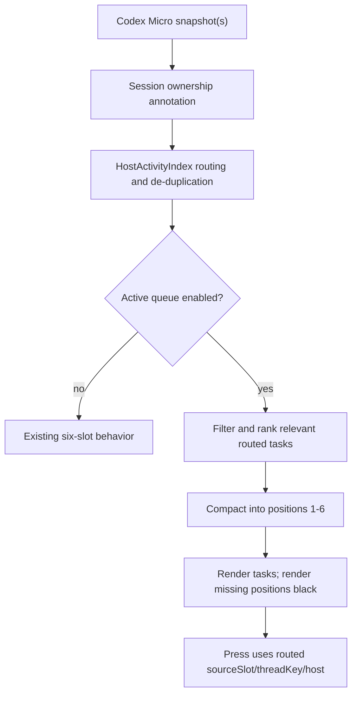

# Active Agent Queue - Plan

## Goal Capsule

- **Objective:** Add an opt-in Stream Deck view that compacts only relevant Codex tasks into the first Agent keys and renders unused positions black.
- **Authority:** The user's queue behavior in the 2026-08-10 session overrides the existing single-host native-order presentation only while the new option is enabled.
- **Execution profile:** Test-first TypeScript change with property-inspector, rendering, controller, multi-host, and documentation coverage.
- **Stop conditions:** Stop if the implementation requires reading task content, a task database, hotkey fallback, a non-loopback CDP endpoint, or an untyped relay expansion.
- **Tail ownership:** `ce-work` owns implementation, review, required repository checks, and local commits on `main`; it does not push or open a PR without separate authority.

---

## Product Contract

### Summary

Add `Active queue` as a global Agent-display option in the plugin property inspector.
The option filters and reorders the current routed set of at most six Codex Micro tasks.
It does not create a new Codex `agentSource` and does not discover tasks outside the native six-slot inputs.

### Problem Frame

With Codex `Most recent chats`, relevant tasks can be present in the native six slots but remain scattered among idle white keys.
The plugin preserves native order whenever only one host is present, so its existing priority comparator runs only in combined multi-host mode.
With four Agent actions placed on a physical profile, tasks in native positions two and five therefore remain separated instead of occupying the first available keys.
Applying the existing comparator alone would reorder all six tasks but would not hide irrelevant idle tasks or produce the requested black reserve positions, so the queue remains a separate opt-in projection.
Codex `Priority chats` can instead return six idle native slots while other recent chats are working; because those off-six chats have no privacy-safe title source, that distinct upstream-composition problem is deferred and the queue is documented to work best with `Most recent chats`.

### Requirements

**Queue membership and order**

- R1. When `Active queue` is enabled, include only user-attention, error, unread/completed, and working tasks from the current routed Agent set.
- R2. Order user-attention and error tasks first, unread/completed tasks second, and working tasks third.
- R3. Order attention and completion groups by the oldest available trustworthy state activity time first, and order working tasks by the newest activity time first. Within a group, place tasks without a trustworthy timestamp after timestamped tasks.
- R4. Use the native `sourceSlot` and stable thread identity as deterministic tie-breakers so an unchanged snapshot does not reshuffle keys.
- R5. Compact matching tasks into logical Agent positions one through six and omit `idle`, `off`, empty, and unknown states. Profiles using fewer actions must place `Agent 1` through `Agent N` contiguously to expose the first N queue entries.

**Empty and input behavior**

- R6. Render every unfilled queue position as solid black with no title, border, state marker, host badge, context ring, or animation while its target health is ready. When no assignment exists because the target is connecting, degraded, or offline, preserve the existing health tile so an outage cannot look like an empty healthy queue.
- R7. Treat a press or release on an unfilled queue position as a no-op without a command, alert, or log error.
- R8. Preserve the captured `RoutedAgentSlot` between key-down and key-up so a queue reorder cannot change the command owner, source slot, or thread. In queue mode, key-up dispatches only when its matching key-down captured an assignment; a black key that fills while held remains a no-op.

**Compatibility and control**

- R9. The option is global to all six Agent actions on one Stream Deck installation and defaults to off when absent.
- R10. When the option is off, preserve existing `pinned`, `recent`, `priority`, and `custom` behavior exactly.
- R11. Apply the queue only after existing single-host or multi-host routing, ownership, mirror de-duplication, and health rules have produced `RoutedAgentSlot` values.
- R12. Preserve relay protocol version 1, the loopback-only CDP boundary, independent local operation on Windows and macOS, and optional authenticated multi-host operation between them.
- R13. Explain beside the property-inspector switch that the queue filters only the current six routed tasks, works best with Codex `Most recent chats`, and makes `pinned` and `custom` positions movable while enabled.

### Acceptance Examples

- AE1. Covers R1, R2, R5, R6. Given two working tasks in native positions two and five and four idle tasks, the first two Agent keys show the working tasks and the remaining four keys are black.
- AE2. Covers R1, R5, R6, R7. Given no relevant tasks, all six Agent keys are black and pressing any of them does nothing.
- AE3. Covers R2, R3, R4. Given two completed tasks with completion times 10:00 and 10:05, the 10:00 task remains ahead of the 10:05 task across identical refreshes.
- AE4. Covers R2, R3. Given four working tasks, the four most recently active tasks fill the first four positions in descending activity order.
- AE5. Covers R8, R11. Given key-down on a remote task followed by a queue reorder, key-up still targets the same captured host, source slot, and thread.
- AE6. Covers R9, R10. Given no saved `activeQueueEnabled` field, the six Agent actions preserve their existing native or combined layout.
- AE7. Covers R13. Given the Agent property inspector, the `Active queue` control states its six-task limit, recommends `Most recent chats`, and warns that fixed `pinned` and `custom` positions are compacted while enabled.
- AE8. Covers R3, R4. Given timestamped and untimestamped tasks in one group, timestamped tasks come first and two identical refreshes preserve the untimestamped order by `sourceSlot` and thread identity.
- AE9. Covers R6. Given no assignment and a degraded or offline target, the Agent key keeps its existing health tile instead of rendering healthy-empty black.
- AE10. Covers R7, R8. Given key-down on a black position followed by a refresh that fills it, key-up still sends nothing and does not alert.

### Scope Boundaries

In scope:

- A compact active/attention projection over the at most six tasks already routed by `HostActivityIndex`.
- A global property-inspector switch and compatibility documentation.
- Black rendering and no-op input for unfilled positions.

Deferred:

- Discovering and naming active tasks outside all native Codex Micro slots.
- Recovering tasks omitted by Codex `Priority chats`; with six idle native inputs the opt-in queue intentionally renders a healthy all-black state.
- A typed full-task renderer catalog after separate Windows and macOS live discovery.
- Strict persistence of FIFO order across plugin restarts when no trustworthy activity timestamp exists.

Out of scope:

- Reading prompt, response, project, or task-database content to synthesize titles.
- Hotkey or task-database fallback.
- Changing Codex's own `Priority chats` implementation or adding a new native `agentSource`.
- Changing relay wire payloads, mobile clients, action UUIDs, package versions, or generated release bundles.

Accepted opt-in tradeoffs:

- Idle and off chats are unreachable from Agent keys while the queue is enabled; disable it to restore those assignments.
- `pinned` and `custom` still select candidates, but their fixed physical positions are compacted while the queue is enabled.

### Success Criteria

- The automated suite proves compaction, black empty positions, no-op input, ordering, stable down/up routing, settings preservation, and disabled-mode compatibility.
- Live-app validation confirms the option works with Codex set to `Most recent chats` without exposing content or changing the six native assignments.
- Physical-device validation remains explicitly unverified while the Stream Deck is disconnected; the ergonomic result is provisional until the zero/one/two/four-task states are checked on hardware.

---

## Planning Contract

### Key Technical Decisions

- KTD1. **Use a separate plugin display option.** `(session-settled: user-directed — chosen over relying on Codex Priority chats: the reported native mode omitted currently working chats.)` Add `activeQueueEnabled?: boolean` beside `showContextRings` and default it to false. This instantiates R9 and preserves R10.
- KTD2. **Project after routing.** Apply the queue to the output of `HostActivityIndex.merge()` rather than adding an `agentSource`. This preserves the ownership and de-duplication contract in R8, R11, and R12.
- KTD3. **Limit the first release to routed native candidates.** `(session-settled: user-directed — chosen over rollout-content title extraction: the user allowed implementation only when it stayed clearly feasible, and the current privacy-safe catalog has no titles.)` Use only tasks already represented by a routed slot. This governs R1 and the deferred full-catalog boundary.
- KTD4. **Prefer structural session activity without changing the wire.** For working or completed tasks, use matching `hostSessions.activityAt` when available and otherwise use a valid routed slot timestamp. For native attention states, use a valid routed slot timestamp. Missing or invalid times are not compared with trustworthy times; those candidates sort last within their group under R3/R4. This supports R3 without adding fields to relay protocol version 1.
- KTD5. **Keep the existing completion lifetime.** Structural completion is eligible only while the existing ownership/routing layer still reports it as `complete`: until it is opened or its five-minute freshness window expires. Native unread/completed status may remain eligible for as long as Codex reports it. The queue does not introduce a second persistence store.
- KTD6. **Render healthy absence as a distinct black image.** Do not reuse the existing `off` tile because it communicates an unassigned white key. A dedicated renderer satisfies R6 and lets the controller short-circuit R7, while non-ready health continues to use the existing diagnostic tile.

### High-Level Technical Design

### Existing Patterns

- `src/relay-protocol.ts` owns status ranking, routed ownership, source slots, thread normalization, and mirror de-duplication.
- `src/controller.ts` owns global display settings, Agent rendering, held press assignments, and image write de-duplication.
- `src/render.ts` owns deterministic in-memory SVG generation.
- `static/property-inspector/agent.html` already preserves unknown global settings while changing `showContextRings`.
- `test/relay.test.ts`, `test/render-theme.test.ts`, and `test/ios-project.test.ts` contain the nearest behavior contracts.

### Risks and Dependencies

- The native six-slot list is an upstream boundary; the queue cannot display a task absent from every routed slot.
- Native and structural activity timestamps can be absent. Deterministic tie-breakers must prevent refresh churn.
- Multi-host clocks can be skewed; ordering uses the timestamps already trusted by the existing routing layer and does not add clock synchronization.
- `pinned` and `custom` positions become a candidate set rather than fixed physical positions only while the opt-in queue is enabled; property-inspector copy must state this clearly.
- A last-known active task from an offline host must keep existing health treatment and must not reroute to another host.

---

## Implementation Units

### U1. Active queue projection

- **Goal:** Filter and rank routed tasks without changing existing routing.
- **Requirements:** R1-R5, R10-R12; AE1-AE4, AE6.
- **Files:** `src/active-queue.ts`, `src/relay-protocol.ts`, `test/active-queue.test.ts`, `test/relay.test.ts`.
- **Approach:** Add a pure projection that accepts routed slots plus the input host snapshots, resolves the best activity timestamp under KTD4, filters irrelevant states, sorts by the R2/R3 contract, and returns compacted slots with new display IDs while retaining host, `sourceSlot`, and `threadKey`.
- **Test scenarios:** zero relevant tasks; two working tasks in positions two and five; attention/completion/working group order; completed FIFO within the existing completion lifetime; working recency; timestamped candidates before stable missing timestamps; four and six candidates; disabled-mode single-host native order; multi-host owner and mirror preservation.
- **Verification:** `node --test --import tsx test/active-queue.test.ts test/relay.test.ts`.

### U2. Settings, black rendering, and no-op input

- **Goal:** Expose the option and make unfilled positions visually and behaviorally empty.
- **Requirements:** R6-R11, R13; AE1, AE2, AE5-AE7, AE9, AE10.
- **Files:** `src/controller.ts`, `src/plugin.ts`, `src/render.ts`, `static/property-inspector/agent.html`, `test/relay.test.ts`, `test/render-theme.test.ts`, `test/ios-project.test.ts`.
- **Approach:** Extend the global Agent display settings, apply U1 after routing, render a dedicated black Agent image when the projected position is missing, and return early for empty queue input before creating a held assignment. Keep key-up bound to any assignment captured before a later reorder. Put the R13 limitation and relocation warning beside the switch so the opt-in is informed at the decision point.
- **Test scenarios:** absent flag defaults off; toggling preserves context rings and unknown fields; inspector copy covers the six-task limit, `Most recent chats`, contiguous `Agent 1`-through-`Agent N` placement, loss of idle-key access, and relocation of `pinned`/`custom`; black SVG has no title/status/host/context elements; non-ready empty positions retain the existing health tile; empty key down/up sends nothing and does not alert; a black key that fills while held still sends nothing on release; active press/release survives a reorder; repeated black rendering uses existing image de-duplication.
- **Verification:** `node --test --import tsx test/relay.test.ts test/render-theme.test.ts test/ios-project.test.ts`.

### U3. Compatibility documentation

- **Goal:** Explain the queue's scope and prevent users from relying on the broken native Priority composition.
- **Requirements:** R9-R12.
- **Files:** `README.md`, `README.ru.md`, `docs/ARCHITECTURE.md`, `docs/MULTI_HOST.md`, `docs/TROUBLESHOOTING.md`.
- **Approach:** Document that `Active queue` is opt-in, works best with Codex `Most recent chats`, filters only the currently routed six-task candidate set, expects contiguous logical Agent indices from one upward, temporarily removes deck access to idle chats, preserves host ownership, and does not discover off-six tasks. State that the exact all-idle `Priority chats` case becomes a healthy all-black queue rather than recovering omitted work.
- **Test scenarios:** Documentation checks retain the loopback CDP, private-state, platform, and independent multi-host boundaries.
- **Verification:** `node --test --import tsx test/ios-project.test.ts test/release-docs.test.ts` and repository documentation tests included by `npm test`.

---

## Verification Contract

| Gate | Command | Expected signal |
|---|---|---|
| Focused behavior | `node --test --import tsx test/active-queue.test.ts test/relay.test.ts test/render-theme.test.ts test/ios-project.test.ts test/release-docs.test.ts` | Queue, input, rendering, routing, inspector, and documentation scenarios pass. |
| Type safety | `npm run check` | TypeScript completes without errors. |
| Automated regression | `npm test` | Full Node test suite passes; Windows-only skips are reported separately. |
| Package validation | `npm run validate` | Build completes and `streamdeck validate` succeeds. |
| Release audit | `npm run audit:release` | Existing release roots contain no forbidden private state. |
| Diff hygiene | `git diff --check` | No whitespace errors. |

Live-app checks:

- With Codex set to `Most recent chats`, enable `Active queue` and confirm current working tasks compact to the first keys.
- With Codex set to `Priority chats`, record the expected all-black result if Codex supplies six idle native slots; do not claim that the plugin discovered omitted tasks.
- Confirm observed working/attention timestamps are present when available and that a missing timestamp degrades to the stable-last rule instead of reshuffling.
- Confirm a completed unread task moves ahead of working tasks and disappears after it becomes idle/read.
- Confirm disabling the option restores exact native positions.
- On optional multi-host, confirm a compacted remote task keeps its original host badge and command owner.

Physical-device checks:

- With the Stream Deck reconnected, verify zero, one, two, four, and more-than-four relevant tasks on the actual four-key profile.
- Verify black keys are visually off and produce no alert when pressed.
- Verify a task that changes state during a held press still receives the matching release.

---

## Definition of Done

- U1-U3 satisfy their cited requirements and test scenarios.
- The option defaults off and preserves all existing behavior when disabled.
- No prompt/response content, task database, hotkey fallback, new relay payload, proprietary asset, personal path, runtime state, or generated release bundle enters the diff.
- Automated checks in the Verification Contract pass.
- Live-app and physical-device results are reported separately and never inferred from fixtures or builds.
- Independent code review has no unresolved actionable finding.
- The final commits contain only the feature, its tests, the plan, and compatibility documentation; abandoned experiments are absent.
