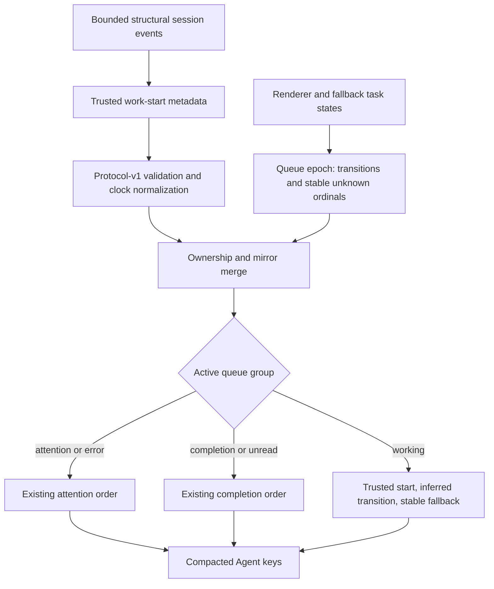

# Stable Active Queue Order - Plan

## Goal Capsule

- **Objective:** Keep working Agent keys stable while the user opens tasks or agents continue background work, and move a working task only when new user-started work makes it meaningfully newer.
- **Authority:** The session-settled working-order decision in this plan supersedes only the working-recency rule in `docs/plans/2026-08-11-001-active-agent-queue-plan.md`; that plan remains authoritative for all other Active queue behavior.
- **Execution profile:** Test-first TypeScript change across session metadata, relay normalization, queue ranking, controller lifecycle, and compatibility documentation.
- **Stop conditions:** Stop if controlled structural traces show that `task_started` is not emitted once per supported user-started turn, or if the fix requires reading prompt or response content, using a task database or hotkey fallback, changing relay protocol version 1, or weakening exact task and host routing.
- **Tail ownership:** Implementation owns automated checks and reports live-app and physical-device validation separately; it does not claim unperformed Windows, multi-host, or hardware checks.

---

## Product Contract

### Summary

Active queue ranks working tasks by their latest trustworthy user-initiated start when one is available; otherwise it preserves a stable queue-local fallback order.
Opening a task, selecting it, background agent activity, and ordinary refreshes leave working Agent keys in place.

### Problem Frame

Active queue currently treats a broad state signature as task activity and sorts working tasks by the resulting timestamp.
Changing the selected Codex task can therefore make the pressed task look newly active and move it to the first Agent key.
Background reasoning, tool calls, assistant output, title changes, and renderer recency can also advance the broad activity signal even though the user did not start new work.

### Key Decisions

- **Working rank follows user-started work.** `(session-settled: user-directed — chosen over selection-only filtering and fully sticky positions: user-started work is the only event that should intentionally move a working task.)` Governs R1-R4.

### Requirements

**Working order**

- R1. Within the working group, order tasks by the newest trustworthy user-initiated start of work first.
- R2. A new trustworthy user-initiated start moves a continuously working task ahead even when no intermediate non-working snapshot was observed; when no trustworthy start exists, R4 governs.
- R3. Opening or selecting a task, changing its title, background reasoning, tool work, assistant output, renderer recency, and ordinary snapshot refreshes must not change its working-group rank.
- R4. When a trustworthy start is unavailable, keep the task on a stable queue-local fallback rank for its continuous working run. A first observation, including one made mid-epoch, is only a stable seed; a fallback transition may advance rank only after the same identity was previously observed in an eligible idle or completion state. Never substitute general activity, file modification time, renderer recency, snapshot receipt time, or attention/error recovery as a user start.

**Compatibility and boundaries**

- R5. Preserve the existing priority of attention and error tasks, then completion and unread tasks, then working tasks; completion ordering continues to use its existing activity semantics.
- R6. Preserve Active queue filtering, compaction, six-task cap, `custom` candidate boundary, authoritative-empty behavior, six-slot fallback, black no-op positions, and captured key-down/key-up routing.
- R7. Preserve disabled-mode behavior and the existing semantics of the general activity signal used by normal source modes, completion freshness, ownership, and mirror reconciliation.
- R8. Carry only optional numeric structural start metadata and a content-free structural event revision through the existing protocol-v1 snapshot boundary; do not read or transmit prompt text, responses, project names, task-database data, or other task content.

### Acceptance Examples

- AE1. **Covers R1-R3.** Given three working tasks ordered A, B, C, opening C and then A leaves the keys ordered A, B, C.
- AE2. **Covers R1-R3.** Given three working tasks, reasoning, tool calls, assistant output, title changes, and repeated snapshots leave their order unchanged.
- AE3. **Covers R1-R2.** Given A, B, C are still working, a new user-started turn for C changes the working order to C, A, B without requiring an observed idle state.
- AE4. **Covers R4.** Given several tasks are already working when a queue epoch begins and no trustworthy starts are available, their first-seen order remains stable across selection and catalog reorder; a later trustworthy start may still move one task.
- AE5. **Covers R4.** Given an unknown task was previously observed idle or complete and later enters working within the same queue epoch, the new transition advances it within the unknown-start tier. A first working observation, working-to-working refresh, or attention/error recovery does not.
- AE6. **Covers R5-R7.** Attention, completion, disabled mode, and `custom` produce the same relative behavior as before this fix.
- AE7. **Covers R6.** A key release still targets the assignment captured on key-down even if a legitimate new user start reorders the queue while the key is held.
- AE8. **Covers R1, R4, R8.** A trusted multi-host owner supplies one structural start event, which receives an immutable queue-local rank after validation and initial clock normalization; delayed repeats, mirror activity, or temporary untrusted keys cannot refresh or inherit it.

### Scope Boundaries

In scope:

- A start-of-work signal derived from structural lifecycle metadata.
- Queue-local fallback ranking for tasks without a trustworthy start.
- Protocol-v1 compatibility, multi-host ownership, regression tests, and user-facing ordering documentation.

Out of scope:

- Fully sticky or manually pinned Agent positions.
- Durable queue-order persistence across plugin restarts or while Active queue is disabled.
- New Stream Deck actions, settings, iOS behavior, or relay protocol versions.
- Changes to attention, completion, filtering, rendering, dispatch, or the native Codex sidebar order.

---

## Planning Contract

### Key Technical Decisions

- KTD1. **Add a distinct structural start-of-work signal.** `(session-settled: user-directed — chosen over selection-only filtering and fully sticky positions: user-started work is the only event that should intentionally move a working task.)` After a controlled structural-trace gate confirms the event semantics, add optional `workStartedAt` and `workStartRevision` values sourced only from the timestamp and byte offset of the latest structural `task_started` event and cite R1-R4. The trusted signal covers new turns during continuous working and cross-host starts that queue-local status transitions cannot identify. Retain the last observed pair in a 24-hour bounded map keyed by trusted conversation identity when the original event later leaves the bounded session tail.
- KTD2. **Keep general activity semantics unchanged.** Continue using `activityAt` for lifecycle freshness, completion order, normal source modes, and ownership reconciliation per R5 and R7. Background lifecycle evidence may keep a task working without changing `workStartedAt`.
- KTD3. **Use a queue epoch for unknown-start fallback.** A dedicated Active queue rank index owned by the long-lived controller assigns stable first-seen ordinals when enabled. First observation of an identity is always a seed, including mid-epoch. Only a later transition from a previously observed idle or completion state to working receives an inferred rank within the unknown-start tier; attention/error recovery and changes inside a working run do not. The index clears when Active queue is disabled, retains disappeared identities for 24 hours, and starts a new epoch after re-enable or process restart.
- KTD4. **Extend relay v1 additively.** Allow and sanitize optional `workStartedAt` and `workStartRevision` metadata without changing protocol version 1. Before receiver-clock normalization, require a finite positive start no later than the sender's snapshot `observedAt` and a non-negative integer revision; drop the pair rather than clamp it when either value is invalid. Old senders omit the pair and old receivers ignore it. Trusted rollout ownership selects the pair for a merged task; renderer mirrors and temporary identities cannot refresh or borrow it.
- KTD5. **Apply an immutable event rank only to working projection.** Attention keeps its current state ordering and completion keeps its current activity ordering. At epoch seed, trustworthy starts are initially ordered by their once-normalized timestamps. Thereafter the rank index recognizes the same event by trusted task identity, owner, and `workStartRevision`, preserves its assigned local rank across repeat snapshots and transport-delay variation, and assigns a new front rank only for a higher trusted revision. On a trusted owner change, preserve the task rank and establish the new owner's current revision as a baseline; only a subsequent higher revision may move it. Tasks with trusted starts rank before unknown tasks; inferred transitions reorder only the unknown tier, followed by stable first-seen ordinal and stable task/host identity. No working comparison uses broad `activityAt`, a repeatedly normalized timestamp, or changing `catalogIndex`.

### High-Level Technical Design

### Risks and Dependencies

- The bounded 512 KiB session tail may not contain the latest start when the plugin first observes a long-running task. That case must remain explicitly unknown and stable rather than using a false recency signal.
- The `task_started` contract is load-bearing. Controlled, content-free live traces must prove that supported user turns, including a follow-up during continuous work, produce exactly one event and that selection, background continuation, retry, compaction, and session resume do not.
- Receiver clock correction includes transport delay. The event revision and immutable local rank must prevent repeated normalization of the same remote start from changing order when network latency varies.
- During mixed-version operation, older senders omit the start pair and their tasks remain in the stable unknown-start tier until that host is upgraded.
- Owned tasks outside the public recent-session list still need structural start metadata on their routed slot or catalog candidate; otherwise full-catalog ordering would regress to the unknown path unnecessarily.
- Queue-local state must use the same trusted conversation identity and exact host-local fallback rules as routing. Reusing title or UUID suffix matching could merge unrelated temporary tasks.
- Clock normalization must cover both positive and negative host skew while leaving owner selection and exact dispatch identity unchanged.
- The additive metadata contributes to the existing relay wire budget. Existing optional-catalog stripping and oversized-base behavior must remain intact.
- A working task seeded below the six-task cap can remain off the Agent keys until a new trusted start is observed. This is an accepted cost of stability; the fix does not add paging or pinning.

### Sources and Existing Patterns

- `docs/plans/2026-08-11-001-active-agent-queue-plan.md` owns the broader Active queue contract that this plan preserves outside working order.
- `src/session-ownership.ts` already parses bounded structural lifecycle records without reading task content.
- `src/relay-protocol.ts` owns activity tracking, optional snapshot validation, receiver-clock normalization, mirror ownership, and bounded protocol-v1 transport.
- `src/active-queue.ts` owns group-specific projection and deterministic tie-breaking.
- `src/controller.ts` owns the long-lived queue lifecycle and captured press assignments.

---

## Implementation Units

### U1. Structural work-start metadata and relay contract

- **Goal:** Produce and transport a trustworthy start-of-work signal without changing general activity semantics or privacy boundaries.
- **Requirements:** R1-R4, R7, R8; AE2, AE3, AE8.
- **Dependencies:** None.
- **Files:** `src/types.ts`, `src/session-ownership.ts`, `src/relay-protocol.ts`, `test/session-ownership.test.ts`, `test/relay.test.ts`.
- **Approach:**
  1. Before changing the contract, run controlled local sessions and inspect only structural event types, timestamps, and offsets. Prove that each supported user turn emits exactly one `task_started`, including a follow-up during continuous working, while selection, background continuation, retry, compaction, and resume do not. Stop and revise the signal choice if this fails.
  2. Extend the structural session result and the owned slot/catalog annotations with optional start timestamp and revision metadata derived only from the latest valid `task_started` record.
  3. Retain a previously observed trusted pair in a trusted-identity-keyed 24-hour bounded map when later tail reads contain only background activity; replace it when a newer structural revision appears.
  4. Preserve `activityAt` and all existing status/completion calculations unchanged.
  5. Add the optional pair to protocol-v1 allowlisting, sanitization, encoding, wire-budget behavior, and receiver-clock normalization. Validate the raw start against the sender's raw `observedAt` before shifting either clock.
  6. During mirror merge, take the trusted pair only from the exact dispatchable rollout owner and never from an untrusted mirror alias.
- **Execution note:** Start with failing parser and relay tests that distinguish user starts from background lifecycle activity.
- **Patterns to follow:** Existing optional `contextUsedPercent` propagation and timestamp normalization in `src/types.ts`, `src/session-ownership.ts`, and `src/relay-protocol.ts`.
- **Test scenarios:**
  - A valid `task_started` followed by reasoning, tool calls, assistant output, title or selection changes retains the original start while broad activity advances normally.
  - Controlled content-free traces prove one event per supported user turn and no event for selection, background continuation, retry, compaction, or resume; a failed proof stops implementation.
  - A later `task_started` replaces the start even while status remains continuously working.
  - A cold-start tail with no retained `task_started` exposes no trustworthy start and does not use file modification time.
  - A start observed before tail rollover remains available during the process after that event leaves the bounded tail.
  - Missing, invalid, negative, non-finite, far-future, or post-`observedAt` starts and invalid revisions are dropped to unknown-start behavior, not clamped.
  - Receiver-clock normalization shifts both activity and start timestamps for positive and negative skew.
  - An old protocol-v1 snapshot without the field remains valid and an additive snapshot stays inside the existing wire-budget behavior.
  - Trusted mirrored tasks use the rollout owner's value; temporary keys with matching suffixes remain separate.
- **Verification:** Structural parsing proves start and activity are independent, relay round trips preserve optional metadata, and existing completion, catalog, ownership, and wire-budget tests remain green.

### U2. Stateful working-rank projection

- **Goal:** Keep working Agent keys stable across viewing and background work while allowing new user work to reorder them.
- **Requirements:** R1-R7; AE1-AE8.
- **Dependencies:** U1.
- **Files:** `src/active-queue.ts`, `src/controller.ts`, `src/relay-protocol.ts`, `test/active-queue.test.ts`, `test/relay.test.ts`.
- **Approach:**
  1. Introduce a queue-only rank index with an explicit enabled epoch and stable identity keys aligned with full-catalog routing.
  2. Seed trustworthy starts once from normalized start time, then freeze the rank for each trusted revision. A repeated or lower revision never recomputes rank; a higher trusted revision receives the next front rank.
  3. Seed every first-seen unknown task from routed order, including first appearance mid-epoch, and preserve its ordinal across refresh and catalog reorder.
  4. Within the unknown tier only, record an inferred rank after a previously observed idle/completion-to-working transition. Ignore attention/error recovery, `selected`, title, broad activity, renderer recency, and poll receipt changes.
  5. Preserve rank across trusted owner changes, take the new owner's current revision as a non-moving baseline, and allow only a later revision to advance the task.
  6. Clear the epoch when Active queue is disabled and prune disappeared identities after 24 hours, matching existing temporary-identity retention.
  7. Change only the working-group comparator and keep attention, completion, filtering, compaction, `custom`, fallback, routing, and held-press behavior on their existing paths.
- **Execution note:** Implement the three-working-agent regression test first, then add lifecycle and multi-host edge cases before changing ranking code.
- **Patterns to follow:** Identity resolution and bounded maps in `src/relay-protocol.ts`; assignment capture and global setting transitions in `src/controller.ts`; group-specific comparator structure in `src/active-queue.ts`.
- **Test scenarios:**
  - Three working tasks retain A, B, C after opening C, opening A, selection flips, title changes, background activity changes, and identical refreshes.
  - A new trusted start for C while all three remain working produces C, A, B.
  - Repeated remote snapshots of the same trusted revision with different receipt delays keep the same rank; a new revision moves the task.
  - Several already-working unknown tasks retain first-seen order when `catalogIndex` changes.
  - A previously unseen task first observed working mid-epoch receives a seed ordinal, not an inferred start.
  - An unknown task previously observed idle or complete and then working advances within the unknown tier; working-to-working and attention/error-to-working transitions do not.
  - Known starts rank newest-first at seed, all known-start tasks precede the unknown tier, and equal trusted starts use stable identity ties.
  - Disable and re-enable starts a new queue epoch while disabled mode remains exactly on the existing merge path.
  - Disappearance and reappearance within retention do not fake a new user start; pruning returns the task to cold-start unknown behavior.
  - Attention and completion groups preserve existing ordering, and `custom`, authoritative empty, six-slot fallback, black no-op positions, and the six-task cap remain unchanged.
  - Multi-host clock skew, delayed mirrors, owner changes, trusted de-duplication, and untrusted temporary identities cannot refresh or steal rank.
  - Key-down followed by a legitimate reorder, option toggle, or refresh still releases against the captured host, source slot, and thread.
- **Verification:** Focused queue and controller tests reproduce the original third-button shuffle before the fix and prove stable keys afterward without changing non-queue snapshots or command targets.

### U3. Compatibility documentation

- **Goal:** Describe the user-visible ordering rule and its degraded cold-start behavior without changing the broader Active queue contract.
- **Requirements:** R1-R8.
- **Dependencies:** U1, U2.
- **Files:** `README.md`, `README.ru.md`, `docs/ARCHITECTURE.md`, `docs/MULTI_HOST.md`, `docs/TROUBLESHOOTING.md`, `docs/plans/2026-08-11-001-active-agent-queue-plan.md`.
- **Approach:** Replace generic “working by recency” wording with the user-start rule, explain that viewing and background output do not reorder keys, and state that missing starts use stable queue-local order until new work is observed. Add a narrow supersession note to the older Active queue plan for its working-recency rule only. Preserve the existing privacy, fallback, `custom`, multi-host, and hardware-validation language.
- **Patterns to follow:** Paired English/Russian README coverage and the existing Active queue compatibility sections.
- **Test scenarios:** Test expectation: none -- documentation mirrors behavior enforced by U1 and U2; repository documentation tests still guard required compatibility wording.
- **Verification:** A reader can predict the A, B, C selection and new-message examples from the docs, and no page implies that generic output recency or task content drives working order.

---

## Verification Contract

| Gate | Command or scenario | Expected signal |
|---|---|---|
| Focused behavior | `node --test --import tsx test/session-ownership.test.ts test/active-queue.test.ts test/relay.test.ts` | Structural starts, stable working order, queue lifecycle, multi-host normalization, and relay compatibility pass. |
| Type safety | `npm run check` | TypeScript completes without errors. |
| Automated regression | `npm test` | Full Node test suite passes; platform-specific skips are reported separately. |
| Package validation | `npm run validate` | Build completes and Stream Deck package validation succeeds. |
| Release artifact audit | `npm run audit:release` | Built release roots contain no forbidden private or runtime state. |
| Diff hygiene | `git diff --check` | No whitespace errors. |
| Live macOS app | With three working tasks A, B, C, open C and wait for background output, then open A; order stays A, B, C. Send new work to C; only then C moves first. | The observed keys match AE1-AE3. |
| Compatibility paths | Exercise attention/completion, queue off/on, and `custom`; exercise Windows-only and optional multi-host paths when available. | Each path is reported as tested or explicitly not run; single-host evidence is not presented as multi-host proof. |
| Physical device | Repeat the three-task scenario on a connected Stream Deck when available. | Reported as tested on hardware or explicitly not run; hardware ergonomics remain separate from tests, build, package validation, and live-app checks. |

---

## Definition of Done

- U1-U3 satisfy their cited requirements and test scenarios.
- Working tasks move only for a new trustworthy structural start revision or, within the unknown tier, an eligible idle/completion-to-working transition observed after a prior non-working state.
- Controlled content-free traces confirm the structural start signal before implementation continues; repeated snapshots of one event retain one immutable local rank despite clock skew or transport-delay variation.
- Selection, opening, background work, title changes, renderer recency, and ordinary refreshes cannot reshuffle a continuous working run.
- Attention, completion, `custom`, disabled mode, catalog fallback, black positions, six-task cap, exact routing, and held-press behavior remain compatible.
- Relay stays at protocol version 1, old snapshots remain valid, optional start metadata is bounded and clock-normalized, and no task content crosses the relay.
- Compatibility documentation matches the implemented known-start and unknown-start behavior in English and Russian.
- Required repository checks pass, with automated, live-app, multi-host, Windows, and physical-device evidence reported separately.
- Abandoned experiments, temporary instrumentation, private runtime data, and generated release bundles are absent from the final diff.
